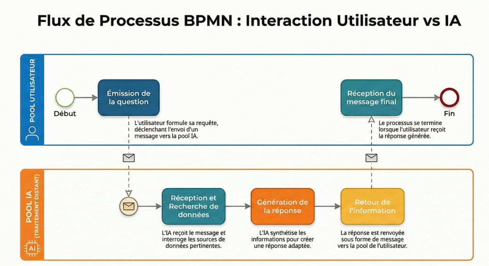

# Projet Oracle — Assistant Intelligent pour le Lore de votre Jeu

## Le problème

Votre jeu possède un univers riche et complexe avec des personnages, des factions, des lieux, des événements historiques et une chronologie détaillée. Les nouveaux joueurs se sentent perdus face à cette quantité d'informations et ont du mal à s'immerger dans l'histoire.

## Notre solution

Nous développons un assistant conversationnel intégré à votre univers. Concrètement, un joueur peut poser une question en langage naturel — par exemple *"Qui est le roi des Terres du Nord ?"* ou *"Que s'est-il passé pendant la Guerre des Ombres ?"* — et recevoir une réponse claire, fidèle au lore officiel.

L'assistant ne génère pas de contenu inventé : il se base uniquement sur les documents de lore que vous nous fournissez.

## Ce que l'assistant permet de faire

Les joueurs pourront poser des questions sur les personnages, les lieux, les factions et les événements du jeu. Ils obtiendront des réponses claires et adaptées à leur niveau, avec des références aux documents sources. L'objectif est de leur permettre de retrouver rapidement une information sans devoir chercher dans toute la documentation.

À terme, l'assistant proposera aussi un historique de conversation et le support de différents formats de lore, que nous définirons ensemble.

## Les étapes du projet

Aujourd'hui, nous travaillons sur un premier prototype fonctionnel basé sur un format de document que nous avons choisi pour avancer rapidement.

Lors de notre prochaine rencontre, nous définirons ensemble le format exact de vos documents de lore et vos priorités. Ensuite, nous adapterons le système à vos besoins réels et nous vous présenterons une version démontrable. 

La dernière étape sera la livraison d'une version finalisée, testée et prête à être utilisée par vos joueurs.

Voici un aperçu simplifié du fonctionnement :   

## Ce dont nous avons besoin de votre part

Pour avancer efficacement, nous aurons besoin des documents de lore de votre jeu (le format sera défini ensemble lors de notre réunion). Il serait aussi utile de connaître vos priorités, notamment les questions que les joueurs posent le plus souvent. Enfin, vos retours à chaque étape nous permettront d'ajuster la solution au mieux.

## L'équipe

Le projet est porté par les Lorekeepers, une équipe de quatre développeurs. Emir coordonne le projet et gère l'ingestion des données. Ediz s'occupe de la recherche dans la base de données. Nicolas développe le module de génération de réponses. Tom conçoit l'interface utilisateur et la documentation.

## Suivi du projet

L'avancement est visible en temps réel sur notre dépôt GitLab. Chaque fonctionnalité est suivie et documentée. Pour toute question ou demande, n'hésitez pas à nous contacter lors de nos réunions planifiées ou via une issue sur le dépôt.

---

*Projet Oracle — Développé pour rendre votre univers accessible à tous les joueurs.*