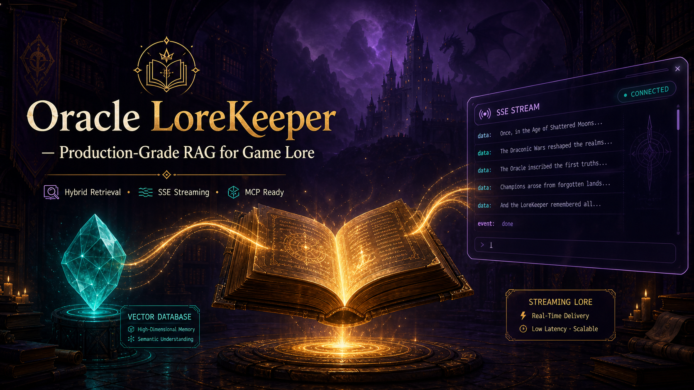

<div align="center">



# RAG — Accounting Intelligence 📊

### Production-grade RAG for accounting professionals

[](https://python.org)
[](https://fastapi.tiangolo.com)
[](https://qdrant.tech)
[](https://cerebras.ai)
[](https://docker.com)
[](https://modelcontextprotocol.io)
[](LICENSE)

`#rag` `#accounting` `#tax` `#fastapi` `#qdrant` `#cerebras` `#mcp` `#ai`

*Zéro PyTorch · Pas de GPU requis · Config-driven · Pipeline traçable*

</div>

---

## Overview

Un moteur de **Retrieval-Augmented Generation (RAG)** pensée pour les professionnels du chiffre. Posez une question sur la législation fiscale, les normes comptables ou les obligations Peppol — le système cherche dans vos documents indexés et stream une réponse sourcée en temps réel.

**Pourquoi pour les comptables ?**

| Problème | Solution |
|---|---|
| Les LLM hallucinent des réponses sur du droit fiscal | Hybrid retrieval (vector + BM25) + reranking + citations des sources |
| Les temps de réponse cassent le rythme de travail | Cerebras inference (~500ms) + Redis semantic cache + SSE streaming |
| Les réglementations changent chaque année (Peppol, TVA, etc.) | Ré-indexation à la demande, pas de fine-tuning |
| Plusieurs clients, plusieurs dossiers | User memory summaries + historique par session + auth Supabase |
| Production fiable | Rate limiting, PII masking, monitoring dashboard |

---

## Architecture

```
┌─────────────┐     ┌──────────────────────────────────────────────┐
│   Client     │     │              RAG Engine                      │
│  (React /   │────▶│                                              │
│   API)       │     │  POST /api/ask → Auth → PII → Security      │
└─────────────┘     │                   ↓                          │
                    │         ┌──────────────┐                     │
┌─────────────┐     │         │ Semantic     │ (cache hit → return)│
│  MCP Client  │────▶│         │ Cache (Redis) │                     │
│(Claude, etc.)│     │         └──────┬───────┘                     │
└─────────────┘     │                ↓ (miss)                      │
                    │         ┌────────────────┐                    │
                    │         │ Parallel       │                    │
                    │         │ Context Fetch  │ ← conversation     │
                    │         │                │ ← user memory      │
                    │         │                │ ← vector memories  │
                    │         └───────┬────────┘                    │
                    │                 ↓                             │
                    │         ┌────────────────┐                    │
                    │         │ Hybrid Retrieval│ ← Qdrant + BM25   │
                    │         │ → RRF fusion   │ ← reranker        │
                    │         │ → HyDE fallback│                    │
                    │         └───────┬────────┘                    │
                    │                 ↓                             │
                    │         ┌────────────────┐                    │
                    │         │  LLM (Cerebras │                    │
                    │         │  / Groq)       │ → SSE stream       │
                    │         └────────────────┘                    │
                    │                 ↓                             │
                    │         Background: cache · persist · track   │
                    └──────────────────────────────────────────────┘
```

---

## Stack

| Layer | Technology | Why |
|---|---|---|
| **API** | FastAPI + Gunicorn/Uvicorn | Async, SSE streaming, auto-docs |
| **Vector DB** | Qdrant | Cloud-native, rapide, filtrage performant |
| **Embeddings** | FastEmbed ONNX (MiniLM 384d) | Pas de GPU, pas de PyTorch, 5ms |
| **Reranker** | FastEmbed ONNX (cross-encoder) | Activation conditionnelle |
| **Lexical** | BM25 (rank-bm25) | Stopwords FR, rattrape les échecs vectoriels |
| **LLM** | Cerebras (llama3.1-8b) / Groq fallback | ~500ms inference, auto-failover |
| **Auth** | Supabase (PostgreSQL + JWT) | Row-level security |
| **Cache** | Redis + SlowAPI | Cache sémantique + rate limiting |
| **Security** | Lakera Guard + regex PII mask | Détection d'injection, conformité RGPD |
| **Frontend** | React + Vite + Tailwind | Statique, servi par FastAPI |
| **Monitoring** | Langfuse | LLM-as-Judge, trace complète |
| **Integration** | MCP Server (stdio/SSE) | Claude Desktop, Cursor, tout client MCP |
| **Deploy** | Docker + Coolify | 2 commandes, zero-downtime |

---

## Quickstart

### Requirements

- Python 3.11+, Node.js 18+, Docker (optionnel)

```bash
git clone https://github.com/ForgedEmir/RAG.git
cd RAG

# Backend
python -m venv venv && source venv/bin/activate
pip install -r requirements.txt

# Frontend
cd src/frontend-react && npm install && npm run build && cd ../..

# Configuration
cp .env.example .env
# → Set LLM_API_KEY, QDRANT_URL, QDRANT_API_KEY, SUPABASE_URL, SUPABASE_SERVICE_ROLE_KEY

# Run
python main.py
# → http://localhost:8000
```

### Docker (production)

```bash
docker compose up --build
# → API:8000  ·  MCP:8001
```

### Makefile

```bash
make setup      # First-time setup
make run        # Dev server
make docker-up  # Production
make test       # 45+ unit tests
make index      # Force reindex
```

---

## API Endpoints

| Endpoint | Method | Auth | Purpose |
|---|---|---|---|
| `/api/ask` | POST | JWT/guest | **Endpoint RAG principal** — SSE stream |
| `/api/feedback/vote` | POST | JWT/guest | Thumbs up/down by trace_id |
| `/api/conversations` | GET/DELETE | JWT/guest | Historique des conversations |
| `/api/monitoring/stats` | GET | monitoring key | Usage global & santé pipeline |
| `/api/cache/stats` | GET | monitoring key | Taux de hit du cache sémantique |
| `/api/admin/sources` | GET | monitoring key | Fichiers sources indexés |
| `/health` | GET | — | Health check des composants |
| *+ 9 more* | | | Voir documentation complète |

**Request:**
```json
POST /api/ask
{
  "question": "Quel est le taux de TVA pour les travaux de rénovation en Belgique ?",
  "session_id": "uuid-v4",
  "user_id": "comptable_uuid"
}
```

**Response:** Server-Sent Events
```
data: {"type": "text", "text": "Le taux de TVA pour les travaux de rénovation..."}
data: {"type": "done", "trace_id": "...", "model": "llama3.1-8b"}
```

---

## Cas d'usage comptables

| Domaine | Exemple de question |
|---|---|
| **TVA** | "Quel est le taux applicable pour la restauration en Belgique ?" |
| **Peppol** | "Quelles entreprises sont concernées par l'obligation Peppol en 2026 ?" |
| **Social** | "Quel est le plafond de rémunération pour un indépendant en 2026 ?" |
| **Fiscal** | "Comment déclarer une plus-value sur cession d'actions ?" |
| **Comptable** | "Quelles sont les règles d'amortissement des immobilisations ?" |
| **RGPD** | "Quelles mentions obligatoires sur une facture B2B ?" |

---

## Key Design Decisions

- **Pas de PyTorch runtime** → Embeddings/reranking via ONNX (FastEmbed). Image Docker légère, pas de GPU nécessaire.
- **Config-driven** → Chaque provider, modèle, feature flag est une variable d'env. Pas de secrets en dur.
- **HyDE + BM25 fallbacks** → Si le score vectoriel est faible, le système tente les embeddings de document hypothétique et la recherche lexicale.
- **Smart rerank** → Cross-encoder activé seulement quand le top-1 vector score est sous le seuil.
- **Single answer pipeline** → Un endpoint (`/api/ask`) fait tout. Simple à intégrer, simple à monitorer.

---

## Testing

```bash
# Tous les tests unitaires (45+)
python -m pytest src/test-unitaires -q

# Tests spécifiques à la recherche
python -m pytest src/test-unitaires/test_search.py -q

# Load testing avec Locust
locust -f src/test-unitaires/locustfile.py --host http://localhost:8000
```

---

## MCP Integration

Claude Desktop, Cursor, ou tout client MCP peut interroger le système directement.

```json
{
  "mcpServers": {
    "rag-accounting": {
      "command": "python",
      "args": ["/path/to/mcp_server.py"],
      "env": {
        "LLM_API_KEY": "...",
        "QDRANT_URL": "...",
        "QDRANT_API_KEY": "..."
      }
    }
  }
}
```

---

## Production Profile

```env
RAG_PROFILE=balanced
WEB_CONCURRENCY=2
REDIS_URL=redis://redis:6379
QDRANT_VECTOR_SIZE=384
RERANKER_ENABLED=true
HYDE_ENABLED=true
SMART_RERANK_ENABLED=true
```

Référence complète → [`docs/DOCUMENTATION.md`](docs/DOCUMENTATION.md)

---

## Documentation

- [Architecture & deployment guide](docs/DOCUMENTATION.md)
- [API reference](docs/docs.html)
- [Supabase schema](docs/supabase_schema.sql)
- [Architecture diagram](docs/architecture-complete.mmd)

---

## Contributing

| Resource | Description |
|---|---|
| [CONTRIBUTING.md](CONTRIBUTING.md) | Setup, workflow, PR process |
| [CODE_OF_CONDUCT.md](CODE_OF_CONDUCT.md) | Community standards |
| [SECURITY.md](SECURITY.md) | Vulnerability reporting |
| [LICENSE](LICENSE) | MIT — free to use, modify, distribute |

---

<div align="center">

**RAG** — Production-grade retrieval-augmented generation for accounting.

[](https://github.com/ForgedEmir)

</div>
