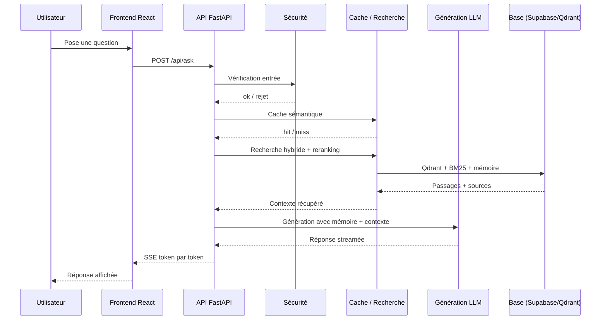
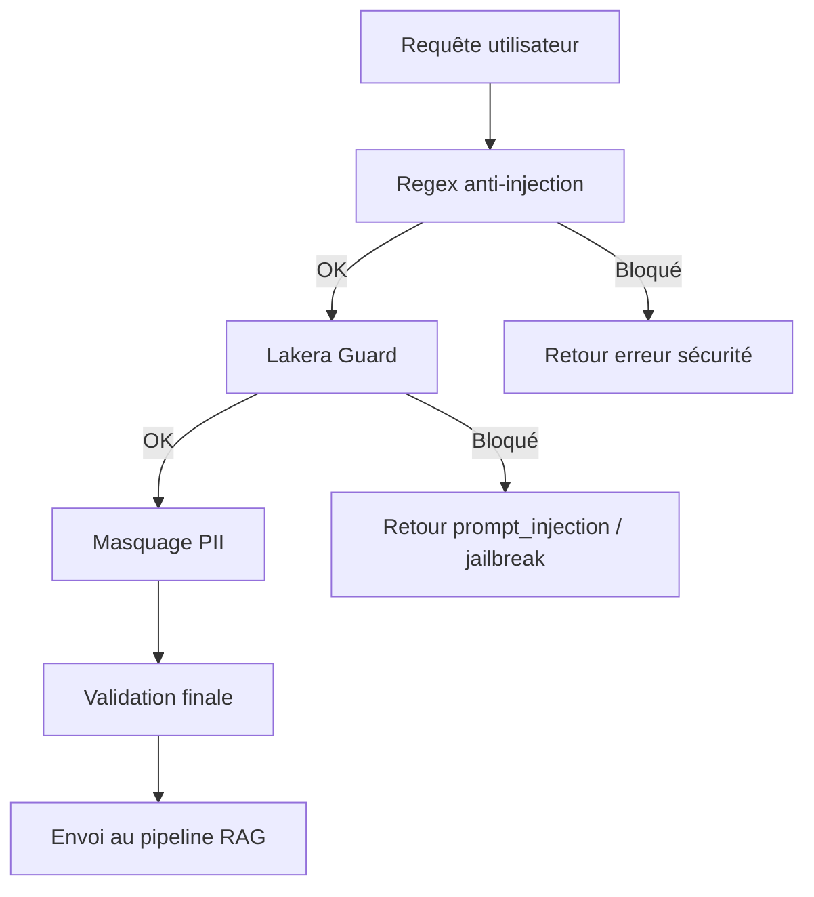
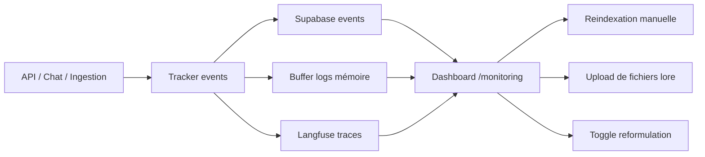

# Schémas des features

Ce document regroupe les schémas principaux du projet **HELMo Oracle / LoreKeeper**.
Il sert de support de présentation et de vue d'ensemble fonctionnelle.

## 1. Carte des features

```mermaid
flowchart TD
    A[HELMo Oracle / LoreKeeper] --> B[Chat RAG]
    A --> C[Sécurité]
    A --> D[Monitoring]
    A --> E[Ingestion]
    A --> F[Authentification]
    A --> G[Audio]
    A --> H[Agent MCP]
    A --> I[Déploiement]

    B --> B1[Recherche hybride
Vectoriel + BM25 + RRF]
    B --> B2[Cache sémantique]
    B --> B3[Reformulation contextuelle]
    B --> B4[Mémoire 3 niveaux]
    B --> B5[Streaming SSE]
    B --> B6[Fallback LLM 4 tiers]

    C --> C1[Regex anti-injection]
    C --> C2[Lakera Guard]
    C --> C3[Masquage PII]
    C --> C4[LLM-as-a-Judge]

    D --> D1[Dashboard /monitoring]
    D --> D2[Logs temps réel]
    D --> D3[Stats pipeline]
    D --> D4[Reindexation]

    E --> E1[Parsing multi-format]
    E --> E2[Chunking]
    E --> E3[Embeddings Qdrant]
    E --> E4[Watchdog auto-reindex]

    F --> F1[Supabase Auth]
    F --> F2[GitHub OAuth]
    F --> F3[Google OAuth]
    F --> F4[Mode guest local]

    G --> G1[TTS Edge]
    G --> G2[STT Whisper]

    H --> H1[ask_lore]
    H --> H2[search_lore]
    H --> H3[Ressources lore://]

    I --> I1[Docker]
    I --> I2[Gunicorn]
    I --> I3[Coolify]
    I --> I4[Redis + Qdrant]
```

## 2. Flux d'une question utilisateur

## 3. Chaîne de sécurité

## 4. Monitoring et exploitation

## 5. Résumé fonctionnel

| Domaine | Ce que ça apporte |
|---|---|
| Chat RAG | Réponses basées sur les documents officiels |
| Sécurité | Réduction des injections, masquage PII, détection des abus |
| Monitoring | Visibilité sur les erreurs, les logs et les performances |
| Ingestion | Ajout facile de nouveaux fichiers lore |
| Auth | Connexion user + OAuth + mode guest en dev |
| Audio | Lecture audio et dictée vocale |
| Agent MCP | Connexion à Claude Desktop / Cursor / Claude.ai |
