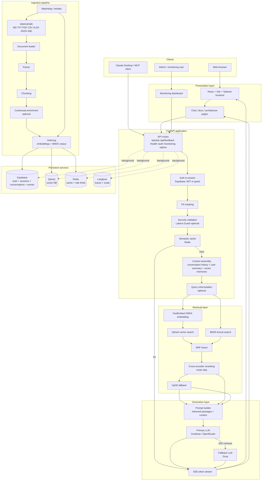

# Oracle LoreKeeper — Technical Documentation

> Complete architecture reference, deployment guide, and operational runbook.

---

## Table of Contents

1. [Project Overview](#1-project-overview)
2. [Architecture](#2-architecture)
3. [API Reference](#3-api-reference)
4. [RAG Pipeline Deep-Dive](#4-rag-pipeline-deep-dive)
5. [Ingestion Pipeline](#5-ingestion-pipeline)
6. [Security Layers](#6-security-layers)
7. [Monitoring & Observability](#7-monitoring--observability)
8. [User Memory & Feedback Loop](#8-user-memory--feedback-loop)
9. [Environment Variables](#9-environment-variables)
10. [Deployment (Coolify)](#10-deployment-coolify)
11. [MCP Server](#11-mcp-server)
12. [Testing](#12-testing)
13. [Troubleshooting](#13-troubleshooting)

---

## 1. Project Overview

Oracle LoreKeeper is a production-grade Retrieval-Augmented Generation (RAG) backend built for **Aethelgard Online**, a fantasy MMORPG. It answers player questions about the game's lore by retrieving grounded evidence from indexed game documents and generating faithful, sourced responses.

**Core goals:**
- Grounded answers — responses always cite retrieved passages, never hallucinate
- Low latency — semantic cache, ONNX inference, Cerebras fast LLM
- Multi-user — per-user rate limiting, session management, conversation memory
- Security — injection detection, PII masking
- Quality — Langfuse LLM-as-Judge (automated, on every response)
- Operational visibility — real-time monitoring dashboard, event tracking
- Extensibility — MCP server for Claude Desktop

**Primary interface:** `POST /api/ask` — accepts a question, returns a Server-Sent Events stream.

---

## 2. Architecture

### 2.0 Complete Architecture Diagram

The complete runtime + ingestion architecture is available as Mermaid in [docs/architecture-complete.mmd](docs/architecture-complete.mmd).



### 2.1 Directory Structure

```
Oracle-LoreKeeper/
├── main.py                         # FastAPI app factory, lifespan, warmup, frontend serving
├── mcp_server.py                   # Model Context Protocol server
├── docker-compose.yml              # Redis + app services
├── Dockerfile                      # Production container
├── Makefile                        # Common dev/ops commands
├── requirements.txt                # Python dependencies
├── .env.example                    # Environment variable template
├── pyproject.toml                  # Project metadata
├── pytest.ini                      # Test configuration
├── docs/
│   ├── DOCUMENTATION.md            # This file
│   └── supabase_schema.sql         # Database schema
├── data/
│   └── sample/                     # Lore source files (MD, PDF, CSV, JSON, XLSX, XML, TXT)
└── src/
    ├── api/
    │   ├── routes.py               # Main endpoints: /ask, /feedback, /health, /auth/*
    │   ├── auth.py                 # JWT validation + guest mode
    │   ├── limiter.py              # Rate limiting (SlowAPI + Redis)
    │   └── blueprints/
    │       ├── monitoring_bp.py    # /api/monitoring/* read-only dashboards
    │       ├── admin.py            # /api/admin/* source file management
    │       └── media.py            # File upload/download
    ├── search/
    │   └── search.py               # Hybrid retrieval: vector + BM25 + RRF + smart rerank
    ├── generation/
    │   └── generator.py            # LLM calls, reformulation, user summary, Langfuse tracing
    ├── ingestion/
    │   ├── run.py                  # Indexing pipeline orchestrator
    │   ├── vector_store.py         # Qdrant interface + dimension validation
    │   ├── chunker.py              # Document chunking strategies
    │   ├── parser.py               # Multi-format parsing (Unstructured, LlamaParse)
    │   ├── document_loader.py      # File discovery and loading
    │   └── watcher.py              # Watchdog for automatic re-indexing
    ├── retrieval/
    │   └── hyde.py                 # Hypothetical Document Embeddings fallback
    ├── monitoring/
    │   └── tracker.py              # Supabase event tracking, statistics, spike detection
    ├── security/
    │   ├── validator.py            # Input validation: Lakera Guard (+ regex helper for ingestion)
    │   ├── pii_masker.py           # PII redaction before LLM calls
    ├── caching/
    │   └── semantic_cache.py       # Redis semantic response cache
    ├── memory/
    │   └── vector_memory.py        # Long-term user memory (vector embeddings)
    ├── config/
    │   └── features.py             # Feature flags and runtime profiles
    ├── tts/
    │   └── tts.py                  # Text-to-speech (edge-tts)
    ├── frontend-react/
    │   ├── src/
    │   │   ├── App.jsx
    │   │   ├── ChatPage.jsx        # Chat UI with MediaRecorder STT
    │   │   ├── MonitoringPage.jsx  # Real-time monitoring dashboard
    │   │   ├── useChat.js          # SSE stream hook
    │   │   └── auth.js             # Supabase auth client
    │   ├── package.json
    │   └── dist/                   # Built static files (served by FastAPI)
    └── test-unitaires/
        ├── conftest.py
        ├── locustfile.py
        ├── test_routes.py
        ├── test_search.py
        ├── test_feedback.py
        └── test_run.py
```

### 2.2 Component Responsibilities

| Component | File | Responsibility |
|---|---|---|
| API | `src/api/routes.py` | Request orchestration, auth, SSE streaming |
| Search | `src/search/search.py` | Hybrid retrieval, RRF fusion, reranking |
| Generation | `src/generation/generator.py` | LLM calls, reformulation, user summary |
| Ingestion | `src/ingestion/run.py` | Document indexing, BM25 corpus building |
| Security | `src/security/` | Injection detection, PII masking |
| Cache | `src/caching/semantic_cache.py` | Redis semantic response cache |
| Memory | `src/memory/vector_memory.py` | Long-term user context |
| Monitoring | `src/monitoring/tracker.py` | Supabase event store, statistics |
| Startup | `main.py` | App wiring, warmup, frontend serving |

---

## 3. API Reference

### `POST /api/ask`

Main RAG endpoint. Returns a Server-Sent Events stream.

**Request:**
```json
{
  "question": "Who is Alaric the Fallen?",
  "session_id": "550e8400-e29b-41d4-a716-446655440000",
  "user_id": "guest_550e8400-e29b-41d4-a716-446655440001"
}
```

**Response (SSE stream):**
```
data: {"type": "text", "text": "Alaric was a renowned general"}
data: {"type": "text", "text": " of the Third Age who..."}
data: {"type": "done", "trace_id": "abc123", "model": "llama3.1-8b"}
```

**Rate limits:** 2 requests / 5 seconds, 30 / minute, 500 / day (per user).

**Auth:** Bearer JWT (Supabase) or guest mode (requires `ALLOW_GUEST_MODE=true`).

---

### `POST /api/feedback`

Submit a quality rating for the last Oracle response.

**Request:**
```json
{
  "session_id": "uuid",
  "rating": 2,
  "comment": "Answer was too vague"
}
```

- Recorded in Supabase regardless of rating
- Langfuse automatically evaluates quality on every response (no user action needed)

---

### `POST /api/feedback/vote`

Alternative feedback using a `trace_id` (returned in the SSE `done` event). Accepts thumbs up/down instead of a 1–5 rating.

**Request:**
```json
{
  "trace_id": "abc123",
  "value": -1,
  "session_id": "uuid",
  "comment": "optional"
}
```

- `value: 1` → positive (equivalent to rating 5)
- `value: -1` → negative (equivalent to rating 1)

---

### Conversation Endpoints

| Endpoint | Method | Description |
|---|---|---|
| `/api/conversations` | GET | History for a session (`?session_id=uuid`) |
| `/api/conversations/list` | GET | All conversations for the current user |
| `/api/conversations/messages` | GET | Raw messages for a session (`?session_id=uuid`) |
| `/api/conversations` | DELETE | Delete conversation history (`?session_id=uuid`) |

All require JWT or guest auth. Access is scoped to the authenticated user.

---

### `GET /health`

Returns status of all system components.

**Response:**
```json
{
  "status": "ok",
  "components": {
    "llm": "ok",
    "qdrant": "ok",
    "supabase": "ok",
    "bm25": "ok",
    "redis": "ok"
  }
}
```

---

### Monitoring Endpoints

All require the `x-monitoring-key` header matching `MONITORING_KEY`.

| Endpoint | Method | Description |
|---|---|---|
| `/api/monitoring/stats` | GET | Global usage statistics (events, latency, throughput) |
| `/api/monitoring/pipeline` | GET | Retrieval pipeline details (cache hits, reranker calls, Qdrant info) |
| `/api/monitoring/features` | GET | Full feature health dashboard (all components in one call) |
| `/api/monitoring/reformulation` | GET | Is reformulation enabled? |
| `/api/monitoring/reformulation` | POST | `{"enabled": true/false}` — toggle reformulation at runtime |
| `/api/monitoring/reformulation/history` | GET | Last 20 reformulated queries |
| `/api/monitoring/search-switches` | GET | Current search config (read-only) |
| `/api/monitoring/runtime-profile` | GET | Active profile: fast / balanced / quality |
| `/api/monitoring/contextual-retrieval` | GET | % of chunks with doc_summary enrichment |
| `/api/monitoring/user-memories` | GET | Last 20 user memory summaries from Supabase |
| `/api/monitoring/feedbacks` | GET | Recent feedback events (`?limit=50`) |
| `/api/monitoring/pii` | GET | PII masking history |
| `/api/monitoring/logs` | GET | In-memory system log buffer |
| `/api/cache/stats` | GET | Semantic cache statistics (hits, misses, size) |

---

### Admin Endpoints

| Endpoint | Method | Description |
|---|---|---|
| `/api/admin/sources` | GET | List indexed files in `data/sample/` |
| `/api/admin/delete` | DELETE | Remove a source file (requires reindex) |
| `/api/reindex` | POST | Force reindex of all source files |

---

## 4. RAG Pipeline Deep-Dive

### 4.1 Full Request Flow

```
POST /api/ask
│
├── 1. Authentication
│   ├── JWT: validate Supabase token → extract user_id
│   └── Guest: validate guest_<uuid> format → use as user_id
│
├── 2. PII Masking (pii_masker.py)
│   └── Redact names, emails, phone numbers, addresses from question
│
├── 3. Security Validation (validator.py)
│   ├── Regex: 70+ injection/jailbreak patterns → instant (<1ms)
│   ├── Lakera Guard (optional): LLM classifier → <50ms
│   └── Block if detected → return 403 with reason
│
├── 4. Meta-question detection (routes.py)
│   └── Questions about Oracle's identity/memory → return fixed polite refusal
│
├── 5. Semantic Cache Lookup (semantic_cache.py)
│   └── Hash of reformulated question → Redis lookup → return if hit
│
├── 6. Parallel Context Fetch
│   ├── get_history(session_id): last 5 Q&A exchanges from Supabase
│   ├── get_user_summary(user_id): 150-word LLM-generated user profile
│   └── search_user_memories(user_id, question): semantic memory search
│
├── 7. Query Reformulation (generator.py)
│   ├── Check if question is already self-contained (no pronouns, no fuzzy refs)
│   └── If not: rephrase with conversation history context → use for search
│
├── 8. Hybrid Retrieval (search.py)
│   ├── Query Analysis: "simple" (≤6 words) → 5 candidates, "complex" → 14
│   │
│   ├── Vector Search
│   │   ├── FastEmbed: embed query → 384-dim vector
│   │   └── Qdrant: cosine similarity top-K
│   │
│   ├── BM25 Fallback (if vector results < MIN_VECTOR_BEFORE_BM25=3)
│   │   ├── Tokenize query with French stopwords
│   │   └── BM25 top-K from in-memory corpus
│   │
│   ├── RRF Fusion (k=60)
│   │   └── Combine vector + BM25 scores → unified ranking
│   │
│   ├── Smart Rerank (Xenova/ms-marco cross-encoder)
│   │   ├── Activated if: top-1 score < 0.014 OR (top-1 - top-2) < 0.01
│   │   └── Re-scores top-6 candidates → returns top-4
│   │
│   └── HyDE Fallback (if all scores below threshold)
│       ├── Generate 3 hypothetical documents answering the question
│       ├── Embed hypothetical docs
│       └── Re-search Qdrant with hypothetical embeddings
│
├── 9. Confidence Score
│   └── Average RRF/reranker scores → 0–100%
│
├── 10. LLM Generation (generator.py)
│   ├── Build system prompt:
│   │   ├── Oracle identity & personality
│   │   ├── Retrieved passages (with source labels)
│   │   ├── User summary (if available)
│   │   └── Vector memories (if available)
│   ├── Add conversation history (last 5 exchanges)
│   ├── Add current question
│   ├── Call Cerebras (llama3.1-8b) with streaming
│   │   └── Fallback: Groq (llama-3.3-70b-versatile) on 429
│   └── Stream SSE chunks to client
│
└── 11. Background Tasks
    ├── Persist Q&A to Supabase
    ├── Write to semantic cache
    ├── Update user summary (every SUMMARY_UPDATE_INTERVAL exchanges)
    ├── Update vector memory (if important enough)
    └── Track event in Supabase
```

### 4.2 Search Parameters

| Parameter | Default | Description |
|---|---|---|
| `SEARCH_SIMPLE_CANDIDATES` | 5 | Candidates for simple queries (≤6 words) |
| `SEARCH_COMPLEX_CANDIDATES` | 14 | Candidates for complex queries |
| `SEARCH_FINAL_TOP_N` | 4 | Passages passed to LLM |
| `MIN_VECTOR_BEFORE_BM25` | 3 | Minimum vector results before enabling BM25 |
| `SMART_RERANK_TOP1_MIN` | 0.014 | Rerank if top-1 score below this threshold |
| `SMART_RERANK_GAP_MIN` | 0.01 | Rerank if gap between top-1 and top-2 is below this |
| `RERANKER_TOP_N` | 6 | Candidates fed to cross-encoder |
| `RERANKER_MAX_INPUT` | 4 | Top-N returned after reranking |

### 4.3 Runtime Profiles

Select via `RAG_PROFILE` env var:

| Profile | Reranker | Candidates | HyDE | Use case |
|---|---|---|---|---|
| `fast` | Disabled | Reduced | Disabled | Lowest latency, lower accuracy |
| `balanced` | Smart activation | Default | Enabled | **Recommended for production** |
| `quality` | Always on | Maximum | Enabled | Best accuracy, slowest |

### 4.4 LLM Configuration

The system is fully config-driven — no hardcoded providers.

```
Primary:      LLM_API_KEY + LLM_BASE_URL + LLM_MODEL
Fallback:     FALLBACK_API_KEY + FALLBACK_BASE_URL + FALLBACK_MODEL
Reformulation: REFORMULATION_API_KEY + REFORMULATION_BASE_URL + REFORMULATION_MODEL
               (falls back to primary if not set)
```

**Current recommended setup:**
```env
LLM_API_KEY=csk_...
LLM_BASE_URL=https://api.cerebras.ai/v1
LLM_MODEL=llama3.1-8b

FALLBACK_API_KEY=gsk_...
FALLBACK_BASE_URL=https://api.groq.com/openai/v1
FALLBACK_MODEL=llama-3.3-70b-versatile
```

---

## 5. Ingestion Pipeline

### 5.1 How It Works

```
data/sample/ (source files)
    │
    ├── Document Discovery (document_loader.py)
    │   └── Scan for: MD, TXT, PDF, CSV, XLSX, JSON, XML
    │
    ├── Parsing (parser.py)
    │   ├── Default: Unstructured library
    │   └── Optional: LlamaParse for complex PDFs (LLAMA_CLOUD_API_KEY required)
    │
    ├── Chunking (chunker.py)
    │   ├── Semantic chunking (LLM-based, optional)
    │   └── Fallback: size-based with overlap
    │
    ├── Late Chunking (run.py — approximation contextuelle)
    │   ├── Chaque chunk est préfixé avec ses N chunks précédents (LATE_CHUNKING_WINDOW=3)
    │   ├── Le texte contextuel est utilisé uniquement pour l'embedding
    │   ├── Le texte original est conservé pour la génération (page_content)
    │   └── Améliore la précision sémantique sur les questions multi-passages
    │
    ├── Enrichment (run.py)
    │   ├── Lore classifier: is this actually game lore? (optional)
    │   ├── Contextual enrichment: add doc_summary to each chunk (optional)
    │   └── Deduplication: skip already-indexed chunks (hash-based)
    │
    ├── Indexing
    │   ├── FastEmbed: embed each chunk → 384-dim vector
    │   ├── Qdrant: upsert with metadata (source, chunk_id, doc_summary)
    │   └── BM25: rebuild corpus JSON (bm25_corpus.json)
    │
    └── File Tracking
        └── Store modification times → enables incremental reindex
```

### 5.2 Triggering Reindex

| Trigger | How |
|---|---|
| Manual | `POST /api/reindex` or `make index` |
| Startup | Automatic if `STARTUP_INDEX_ENABLED=true` |
| File change | Watchdog detects changes if `WATCHDOG_ENABLED=true` |

### 5.3 Adding Lore Documents

1. Drop files into `data/sample/` (supported: `.md`, `.txt`, `.pdf`, `.csv`, `.xlsx`, `.json`, `.xml`)
2. Trigger reindex (or wait for watchdog)
3. New content is immediately searchable

### 5.4 Key Configuration

```env
PARSER=unstructured                           # unstructured | custom
LLAMA_CLOUD_API_KEY=                          # LlamaParse for complex PDFs

INGESTION_LORE_CLASSIFIER_ENABLED=false       # Validate "is this lore?" before indexing
INGESTION_CONTEXTUAL_ENRICHMENT_ENABLED=true  # Add doc_summary to chunks
CHUNK_DEDUP_ENABLED=true                      # Skip already-indexed chunks
LATE_CHUNKING_ENABLED=true                    # Context-prefix each chunk before embedding (default: true)
LATE_CHUNKING_WINDOW=3                        # Number of preceding chunks used as context prefix

STARTUP_INDEX_ENABLED=true
STARTUP_WARMUP_ENABLED=true
WATCHDOG_ENABLED=true
```

---

## 6. Security Layers

### 6.1 Input Validation (validator.py)

**Request validation — Lakera Guard** (optional, <50ms):
- LLM-based classifier for jailbreak/prompt-attack detection on user questions
- Three modes:
  - `enforce`: block detected requests
  - `shadow`: log but allow (monitoring only)
  - `disabled`: off

**Ingestion regex helper — `check_patterns()`**:
- Regex patterns are still used during ingestion chunk filtering (`src/ingestion/run.py`)
- This protects the indexed corpus from obvious prompt-injection payloads

```env
LAKERA_API_KEY=
LAKERA_PROJECT_ID=
LAKERA_MODE=enforce       # enforce | shadow | disabled
SECURITY_VALIDATOR=true   # true | false | disabled
```

### 6.2 PII Masking (pii_masker.py)

Applied before any LLM call. Redacts:
- Names (person entities)
- Email addresses
- Phone numbers
- Street addresses

The original question is used for display; the masked version is used for retrieval and generation.

### 6.3 Meta-Question Detection (routes.py)

Prevents the Oracle from answering questions about its own nature, capabilities, or user data:
- Keywords: "qui es-tu", "comment tu fonctionnes", "mes données", "ta mémoire", etc.
- Returns a fixed, in-character refusal

### 6.4 LLM-as-Judge (Langfuse)

Quality evaluation is fully delegated to **Langfuse**, which automatically scores every response without requiring user feedback.

Langfuse evaluates three dimensions visible in the dashboard:
- **Correctness**: Is the answer factually correct?
- **Context Relevance**: Are the retrieved passages relevant to the question?
- **Hallucination**: Does the answer introduce information not present in the context?

This runs automatically on every traced response. No local LLM call is triggered by user feedback — ratings and votes are stored in Supabase for analytics only.

To enable: set `LANGFUSE_PUBLIC_KEY`, `LANGFUSE_SECRET_KEY`, and `LANGFUSE_HOST` in your `.env`.

---

## 7. Monitoring & Observability

### 7.1 Supabase Event Tracking (tracker.py)

Every significant system event is logged to Supabase:

| Event type | Triggered by |
|---|---|
| `question` | Successful `/api/ask` call |
| `injection_regex` | Regex pattern match in validator |
| `injection_lakera` | Lakera Guard detection |
| `rate_limit` | User hit rate limit |
| `error` | Unhandled exception in pipeline |
| `judge_flag` | (legacy — no longer emitted) |
| `cache_hit` | Semantic cache served response |
| `fallback` | Primary LLM failed, fallback activated |
| `feedback_vote` | `/api/feedback/vote` received |
| `feedback_legacy` | `/api/feedback` (rating) received |
| `reindex` | `/api/reindex` triggered |
| `voice` / `tts` | TTS request |
| `upload` / `upload_blocked` | Media upload event |

**In-memory buffers:**
- Trace context: 7200s TTL, max 5000 entries
- Feedback events: max 500 entries

### 7.2 Spike Detection

Automatic alert if >10 injection events are detected in a 5-minute window (`SPIKE_THRESHOLD=10`, `SPIKE_WINDOW_MIN=5`). Logged via Sentry (if configured) and surfaced in `/api/monitoring/stats`.

### 7.3 Langfuse Tracing (optional)

Full pipeline tracing — from question received to SSE stream complete.

```env
LANGFUSE_PUBLIC_KEY=pk-lf-...
LANGFUSE_SECRET_KEY=sk-lf-...
LANGFUSE_HOST=https://cloud.langfuse.com
```

### 7.4 Frontend Monitoring Dashboard

React page at `/monitoring` displays:
- Total questions, cache hit rate, average latency
- Security events timeline
- Recent reformulations
- Current runtime profile
- Search pipeline stats

---

## 8. User Memory & Feedback Loop

### 8.1 Conversation Memory

Per-session short-term memory:
- Last `CONVERSATION_DEPTH` (default 5) exchanges stored in Supabase
- Loaded at start of each request for context continuity

### 8.2 User Summary

Long-term user profile (LLM-generated, max 150 words):
- Updated every `SUMMARY_UPDATE_INTERVAL` exchanges (default 5)
- Injected into system prompt for personalized responses
- Stored in Supabase per user_id

### 8.3 Vector Memory (optional)

Semantic long-term memory:
- Important Q&A pairs stored as embeddings
- Retrieved by semantic similarity at query time
- Max `MAX_USER_MEMORIES` per user (default 500)

```env
VECTOR_MEMORY_ENABLED=false
MAX_USER_MEMORIES=500
SUMMARY_UPDATE_INTERVAL=5
SUMMARY_IMPORTANCE_MIN_LEN=80
```

### 8.4 Feedback Loop

```
User rates response (1–5) or votes (-1/+1)
    ↓
Rating stored in Supabase (feedback table)
    ↓
Langfuse automatically evaluates quality
on every response independently of user feedback
```

---

## 9. Environment Variables

### LLM Providers

```env
# Primary (Cerebras recommended)
LLM_API_KEY=csk_...
LLM_BASE_URL=https://api.cerebras.ai/v1
LLM_MODEL=llama3.1-8b

# Fallback (Groq)
FALLBACK_API_KEY=gsk_...
FALLBACK_BASE_URL=https://api.groq.com/openai/v1
FALLBACK_MODEL=llama-3.3-70b-versatile

# Reformulation (optional — falls back to primary if not set)
REFORMULATION_API_KEY=
REFORMULATION_BASE_URL=
REFORMULATION_MODEL=
```

### Vector Database

```env
QDRANT_URL=https://...                      # Empty = local mode
QDRANT_API_KEY=

EMBEDDING_MODEL=sentence-transformers/paraphrase-multilingual-MiniLM-L12-v2
# Alternative for higher quality: intfloat/multilingual-e5-large

QDRANT_VECTOR_SIZE=                         # Auto-detected from model if empty
QDRANT_AUTO_RECREATE_ON_DIM_MISMATCH=true
```

### Auth & Database

```env
SUPABASE_URL=https://...
SUPABASE_SERVICE_ROLE_KEY=
SUPABASE_ANON_KEY=

ALLOW_GUEST_MODE=true
```

### Cache & Concurrency

```env
REDIS_URL=redis://localhost:6379            # Empty = local in-memory (single worker only)

WEB_CONCURRENCY=2
BACKGROUND_MAX_WORKERS=16
GUNICORN_TIMEOUT=120
GUNICORN_GRACEFUL_TIMEOUT=30
GUNICORN_KEEPALIVE=10
```

### Security

```env
MONITORING_KEY=your-secret-key

LAKERA_API_KEY=
LAKERA_PROJECT_ID=
LAKERA_MODE=enforce                         # enforce | shadow | disabled

SECURITY_VALIDATOR=true                     # true | false | disabled
```

### RAG Pipeline

```env
RAG_PROFILE=balanced                        # fast | balanced | quality

REFORMULATION_ENABLED=true
QUERY_EXPANSION_ENABLED=false
HYDE_ENABLED=true
HYDE_TIMEOUT_SECONDS=3.5

RERANKER_ENABLED=true
RERANKER_MODEL=Xenova/ms-marco-MiniLM-L-6-v2
RERANKER_MAX_INPUT=4
RERANKER_TOP_N=6
SMART_RERANK_ENABLED=true
SMART_RERANK_TOP1_MIN=0.014
SMART_RERANK_GAP_MIN=0.01
RERANK_SIMPLE_QUERIES=false

SEARCH_SIMPLE_CANDIDATES=5
SEARCH_COMPLEX_CANDIDATES=14
SEARCH_FINAL_TOP_N=4
MIN_VECTOR_BEFORE_BM25=3
BM25_FR_NORMALIZATION=true

MAX_RESPONSE_SECONDS=10                     # 0 = no timeout
CONVERSATION_DEPTH=5
```

### Ingestion

```env
PARSER=unstructured
LLAMA_CLOUD_API_KEY=

INGESTION_LORE_CLASSIFIER_ENABLED=false
INGESTION_CONTEXTUAL_ENRICHMENT_ENABLED=true
CHUNK_DEDUP_ENABLED=true
LATE_CHUNKING_ENABLED=true   # Préfixe chaque chunk avec ses N voisins précédents avant embedding
LATE_CHUNKING_WINDOW=3       # Nombre de chunks précédents utilisés comme contexte

STARTUP_INDEX_ENABLED=true
STARTUP_WARMUP_ENABLED=true
WATCHDOG_ENABLED=true
```

### Observability

```env
LANGFUSE_PUBLIC_KEY=
LANGFUSE_SECRET_KEY=
LANGFUSE_HOST=https://cloud.langfuse.com

SENTRY_DSN=

TRACKING_ENABLED=true
```

### Speech-to-Text (optional)

Used by the `/api/stt` endpoint (browser microphone → Whisper transcription).

```env
STT_API_KEY=                              # Defaults to LLM_API_KEY if not set
STT_BASE_URL=https://api.groq.com/openai/v1
STT_MODEL=whisper-large-v3
```

### User Memory

```env
VECTOR_MEMORY_ENABLED=false
MAX_USER_MEMORIES=500
SUMMARY_UPDATE_INTERVAL=5               # Update user summary every N exchanges
SUMMARY_IMPORTANCE_MIN_LEN=80           # Min answer length to be stored as memory
```

### Semantic Cache Tuning

```env
SEARCH_CACHE_TTL=300                    # Cache TTL in seconds
SEARCH_CACHE_SIZE=100                   # Max number of cached entries
```

### Deployment

```env
APP_ENV=production
ENV=production

ALLOWED_ORIGINS=https://your-domain.com    # Empty = localhost only
PORT=8000
```

---

## 10. Deployment (Coolify)

### Pre-deployment Checklist

- [ ] All secrets configured in Coolify environment variables (never committed to git)
- [ ] Redis service added (Coolify managed Redis or external)
- [ ] `REDIS_URL` points to Redis service
- [ ] `ALLOWED_ORIGINS` includes your deployment domain
- [ ] Qdrant cloud configured (`QDRANT_URL` + `QDRANT_API_KEY`)
- [ ] Supabase project configured with schema from `docs/supabase_schema.sql`
- [ ] Health check enabled: `GET /health`

### Docker Setup

The `docker-compose.yml` defines two services:
- `app`: FastAPI backend + React frontend (port 8000)
- `redis`: Redis cache (internal only)

```bash
docker compose up --build
```

### Recommended Production Environment

```env
APP_ENV=production
ENV=production
RAG_PROFILE=balanced

WEB_CONCURRENCY=2
BACKGROUND_MAX_WORKERS=16
GUNICORN_TIMEOUT=120
GUNICORN_GRACEFUL_TIMEOUT=30
GUNICORN_KEEPALIVE=10

REDIS_URL=redis://redis:6379

QDRANT_AUTO_RECREATE_ON_DIM_MISMATCH=true
RERANKER_ENABLED=true
SMART_RERANK_ENABLED=true
HYDE_ENABLED=true
HYDE_TIMEOUT_SECONDS=3.5
MAX_RESPONSE_SECONDS=10
```

### Scaling Notes

- **2 workers** is recommended for most deployments (best RAM/throughput ratio for ONNX models)
- Increase to 3 workers only if CPU is consistently below 70% and RAM allows
- Redis is required for shared rate limiting across workers
- Qdrant Cloud is recommended over local mode in production (persistence, backups)

---

## 12. Testing

### Unit Test Suite

```bash
# Run all tests
python -m pytest src/test-unitaires -q

# Run with verbose output
python -m pytest src/test-unitaires -v

# Run specific test file
python -m pytest src/test-unitaires/test_search.py -v

# Run after retrieval or route changes (fast feedback loop)
python -m pytest src/test-unitaires/test_search.py src/test-unitaires/test_routes.py -q
```

### Load Tests

```bash
# Windows
set RUN_LOAD_TESTS=true
python -m pytest src/test-unitaires/test_load.py -v -s

# Linux/macOS
export RUN_LOAD_TESTS=true
python -m pytest src/test-unitaires/test_load.py -v -s
```

Load tests cover: 1000 concurrent requests, cache hit rate validation, memory leak detection, security under load, and SSE stream reliability.

### Locust Load Testing

```bash
set LOCUST_BEARER_TOKEN=<your_jwt>
locust -f src/test-unitaires/locustfile.py --host http://localhost:8000

# Headless mode
locust -f src/test-unitaires/locustfile.py --host http://localhost:8000 \
  --users 15 --spawn-rate 3 --run-time 60s --headless
```

---

## 11. MCP Server

Oracle LoreKeeper exposes a Model Context Protocol (MCP) server for integration with Claude Desktop and other MCP-compatible clients.

### Start

```bash
# Stdio mode (local, embedded)
python mcp_server.py

# SSE mode (remote)
export MCP_TRANSPORT=sse
export MCP_PORT=8001
python mcp_server.py
```

### Claude Desktop Configuration

`%APPDATA%\Claude\claude_desktop_config.json`:
```json
{
  "mcpServers": {
    "lorekeeper": {
      "command": "python",
      "args": ["C:/path/to/mcp_server.py"],
      "env": {
        "LLM_API_KEY": "csk_...",
        "QDRANT_URL": "https://...",
        "QDRANT_API_KEY": "...",
        "SUPABASE_URL": "https://...",
        "SUPABASE_SERVICE_ROLE_KEY": "..."
      }
    }
  }
}
```

---

## 13. Troubleshooting

### Slow Responses

1. Check if semantic cache is working (`/api/monitoring/pipeline` → cache hit rate)
2. Verify warmup ran at startup (`STARTUP_WARMUP_ENABLED=true`)
3. Check LLM provider latency (Cerebras dashboard)
4. Disable expensive optional features:
   ```env
   QUERY_EXPANSION_ENABLED=false
   INGESTION_CONTEXTUAL_ENRICHMENT_ENABLED=false
   RERANK_SIMPLE_QUERIES=false
   ```
5. Reduce reranker inputs: `RERANKER_MAX_INPUT=4`

### Qdrant Dimension Errors

**Symptom:** `DimensionMismatch` or empty search results after changing embedding model.

**Fix:**
```env
QDRANT_AUTO_RECREATE_ON_DIM_MISMATCH=true
```
Then trigger a full reindex: `POST /api/reindex?force=true`.

Note: Changing the embedding model requires a full reindex. All previously indexed data will be re-embedded with the new model.

### BM25 Missing on Coolify

**Symptom:** Search works locally but falls back heavily to vector-only on deployment.

**Cause:** `bm25_corpus.json` is generated locally and not committed to git.

**Fix:** Ensure `STARTUP_INDEX_ENABLED=true` so the corpus is rebuilt at startup on first deploy.

### Redis Not Available

**Symptom:** Rate limiting errors, semantic cache not working.

**Check:** `/health` will show `"redis": "error"`.

**Fix:**
- Verify `REDIS_URL` is correctly set
- Confirm Redis service is running: `docker compose ps`
- In local dev without Redis: leave `REDIS_URL` empty (in-memory fallback, single-worker only)

### Saturation Under Load

**Symptom:** Increasing error rate or p95 latency spikes under concurrent requests.

**Checklist:**
1. Redis is running (shared rate limiting)
2. Try increasing workers: `WEB_CONCURRENCY=3` (monitor RAM)
3. Check Cerebras/Groq rate limits (429 responses cause fallback latency)
4. Consider extending cache TTL:
   ```env
   SEARCH_CACHE_TTL=600
   ```

### Gunicorn on Windows

Gunicorn does not support Windows natively. For Windows development:
- Use `python main.py` (single Uvicorn worker)
- For production-like multi-worker testing: use Docker (`docker compose up --build`)
