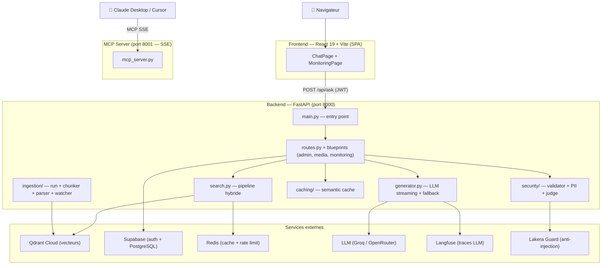
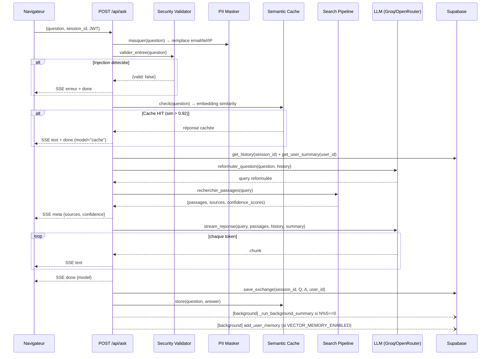
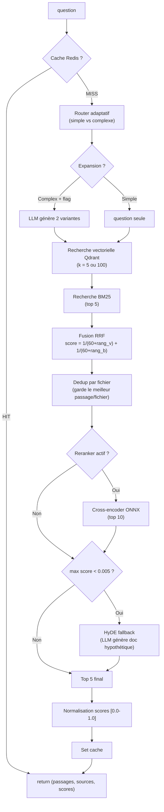
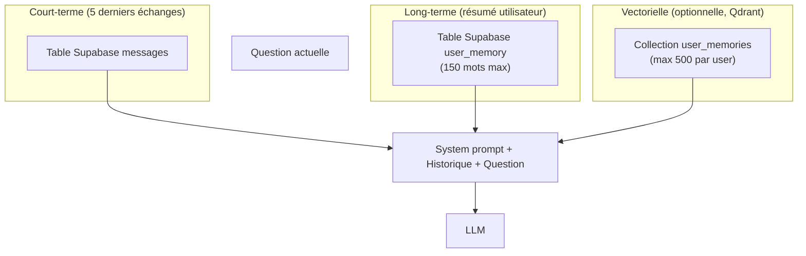
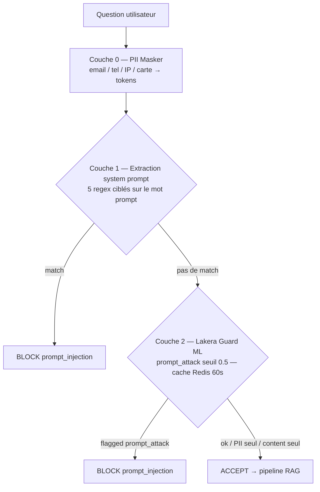
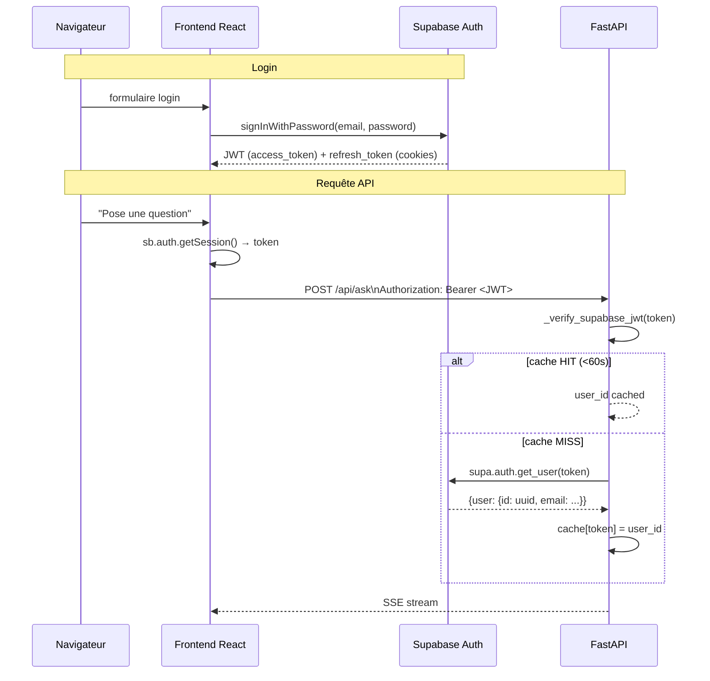

# Oracle-LoreKeeper — Review Technique (Exam Oral)

> Niveau cible : tu es familier du concept RAG et tu dois pouvoir expliquer **chaque pièce** du projet Oracle-LoreKeeper,
> comprendre **pourquoi** elle existe, et répondre à toutes les questions techniques que le jury pourrait poser.

---

## Sommaire

- [Thème 1 — Architecture & Point d'entrée](#thème-1--architecture--point-dentrée)
- [Thème 2 — Pipeline RAG complet](#thème-2--pipeline-rag-complet)
- [Thème 3 — Recherche hybride (Qdrant + BM25 + RRF + Reranker + HyDE)](#thème-3--recherche-hybride)
- [Thème 4 — Ingestion & Chunking](#thème-4--ingestion--chunking)
- [Thème 5 — Génération LLM & Fallback 4 niveaux](#thème-5--génération-llm--fallback-4-niveaux)
- [Thème 6 — Mémoire conversationnelle (3 niveaux)](#thème-6--mémoire-conversationnelle-3-niveaux)
- [Thème 7 — Cache (3 couches)](#thème-7--cache-3-couches)
- [Thème 8 — Sécurité (Whitelist / Regex / Lakera / PII / Judge)](#thème-8--sécurité)
- [Thème 9 — Authentification Supabase](#thème-9--authentification-supabase)
- [Thème 10 — Monitoring & Observabilité](#thème-10--monitoring--observabilité)
- [Thème 11 — TTS / STT](#thème-11--tts--stt)
- [Thème 12 — Agent ReAct](#thème-12--agent-react)
- [Thème 13 — Serveur MCP](#thème-13--serveur-mcp)
- [Thème 14 — Frontend React](#thème-14--frontend-react)
- [Thème 15 — Déploiement (Docker + Coolify + Gunicorn)](#thème-15--déploiement)
- [Thème 16 — Tests (49/49)](#thème-16--tests)
- [Thème 17 — Hyperparamètres & Variables d'env clés](#thème-17--hyperparamètres--variables-denv-clés)

---

## Thème 1 — Architecture & Point d'entrée

### 1.1 Vue d'ensemble

Oracle-LoreKeeper est un **assistant conversationnel RAG** pour le lore du jeu fictif **Aethelgard Online**. Le principe est radical : **aucune hallucination** — toutes les réponses proviennent exclusivement de documents officiels indexés dans la base vectorielle.



### 1.2 `main.py` — Point d'entrée FastAPI

Le fichier [main.py](../main.py) est court (135 lignes) mais dense. Il contient **cinq responsabilités** :

1. **Chargement du `.env`** (via `python-dotenv`)
2. **Init Sentry** (si `SENTRY_DSN` défini) — error tracking
3. **Buffer de logs en mémoire** (`deque` de 200 lignes) exposé à `/api/monitoring/logs`
4. **Instance FastAPI** avec lifespan pour l'indexation initiale
5. **Montage des fichiers statiques React** + SPA fallback

#### Le lifespan — pourquoi c'est important

```python
@asynccontextmanager
async def lifespan(app: FastAPI):
    if not _startup_done:
        _startup_done = True
        # Indexation initiale EN BACKGROUND → le serveur répond aux health checks immédiatement
        threading.Thread(target=index_data, kwargs={"force_reindex": False}, daemon=True).start()
        start_watchdog()
    yield
    stop_watchdog()
```

**Pourquoi un thread et pas `await` ?** L'indexation appelle des libs synchrones (LLM, FastEmbed, Qdrant). Si on bloquait l'event loop au démarrage, Coolify penserait que le service est down et le redémarrerait avant que l'indexation finisse. Le thread permet au serveur de répondre à `/health` immédiatement.

**Pourquoi `daemon=True` ?** Un thread daemon est tué automatiquement quand le processus principal se termine — évite d'empêcher l'arrêt propre du serveur.

### 1.3 FastAPI c'est quoi exactement ?

FastAPI construit des **API REST** sur le runtime **ASGI** (Asynchronous Server Gateway Interface). REST est un ensemble de conventions :

- Verbes HTTP pour l'action : `GET`/`POST`/`PATCH`/`DELETE`
- URLs = ressources : `/api/conversations/{id}`
- Stateless : chaque requête est indépendante
- Réponses en JSON

**ASGI vs WSGI :** WSGI est synchrone (Flask/Django classique). ASGI supporte `async/await` et les connexions longues (WebSocket, SSE). Uvicorn est un serveur ASGI — c'est lui qui écoute le port 8000 et traduit HTTP en appels Python.

```
Navigateur → Uvicorn (ASGI server) → FastAPI (framework) → ta fonction async
```

### 1.4 Les middlewares utilisés

Le projet utilise **deux middlewares** dans [main.py](../main.py) :

```python
# 1. CORS — autorise le frontend à appeler l'API depuis un autre domaine
app.add_middleware(CORSMiddleware, allow_origins=_allowed_origins, ...)

# 2. NoCacheStaticMiddleware — custom, désactive le cache HTML en dev
class NoCacheStaticMiddleware(BaseHTTPMiddleware):
    async def dispatch(self, request, call_next):
        response = await call_next(request)
        if _is_dev and path.startswith("/assets/"):
            response.headers["Cache-Control"] = "no-cache, no-store, must-revalidate"
        return response
```

**Pourquoi le CORS ?** Le navigateur bloque par défaut toute requête vers un domaine différent de celui de la page (Same-Origin Policy). En prod, Vercel/Coolify sert le frontend sur un domaine, l'API sur un autre → sans CORS, ça ne passe pas. Les headers CORS disent au navigateur "oui, autorisé".

**Pourquoi le no-cache ?** En prod, si on déploie une nouvelle version du HTML mais que le navigateur le cache, l'utilisateur voit l'ancienne. Le header `Cache-Control: no-cache` force la revalidation à chaque chargement.

### 1.5 SPA Fallback

FastAPI sert aussi le **frontend React** comme fichiers statiques :

```python
@app.get("/{full_path:path}", include_in_schema=False)
async def spa_fallback(full_path: str):
    if full_path.startswith("api/"):
        return JSONResponse({"error": "Not found"}, status_code=404)
    # Toutes les autres routes → index.html (React Router gère côté client)
    return _FileResponse(os.path.join(_frontend, "index.html"))
```

**Pourquoi ce pattern ?** React Router gère le routing côté navigateur : `/chat`, `/monitoring`, `/login` sont des routes **virtuelles** qui n'existent pas sur le serveur. Si l'utilisateur fait refresh sur `/chat`, le serveur doit retourner `index.html` (qui charge React qui lit l'URL). C'est le **SPA Fallback** — catch-all qui sert le même HTML pour toutes les routes non-API.

### 1.6 Endpoints API principaux

| Endpoint | Méthode | Auth | Rate limit | Rôle |
|---|---|---|---|---|
| `/health` | GET | — | — | Checks LLM, Qdrant, Supabase |
| `/api/auth/config` | GET | — | — | Renvoie URL/clé Supabase pour le frontend |
| `/api/auth/me` | GET | JWT | — | Identité du user connecté |
| `/api/ask` | POST | JWT | 10/min | Question RAG (SSE stream) |
| `/api/ask_agent` | POST | JWT | 10/min | Question via agent ReAct |
| `/api/feedback` | POST | JWT | — | Feedback 1-5 + déclenche judge si ≤ 2 |
| `/api/reindex` | POST | Key | 5/hour | Force la réindexation |
| `/api/admin/upload` | POST | Key | 20/hour | Upload fichier lore |
| `/api/admin/sources` | GET | Key | — | Liste fichiers indexés |
| `/api/admin/delete` | DELETE | Key | — | Supprime un fichier |
| `/api/tts` | POST | — | — | Texte → MP3 |
| `/api/stt` | POST | — | — | Audio → texte |
| `/api/monitoring/stats` | GET | Key | — | Stats globales |
| `/api/cache/stats` | GET | Key | — | Stats cache sémantique |

### Points à retenir (Thème 1)

| Question probable | Réponse courte |
|---|---|
| FastAPI c'est quoi ? | Framework REST async sur ASGI (via Uvicorn). Routes décorées avec `@router.get`, validation Pydantic auto |
| Pourquoi ASGI et pas WSGI ? | ASGI supporte async/await + streaming SSE — indispensable pour notre use case LLM |
| C'est quoi un middleware ? | Couche qui intercepte toutes les requêtes avant/après la route. Ici : CORS + no-cache HTML |
| Pourquoi le CORS ? | Navigateur bloque les requêtes cross-domain par défaut (Same-Origin Policy) |
| Pourquoi le lifespan ? | Indexation initiale lancée au démarrage du serveur sans bloquer les healthchecks |
| C'est quoi le SPA fallback ? | Sert `index.html` pour toutes les routes non-API → React Router gère le routing côté client |
| Pourquoi un thread daemon pour l'indexation ? | Thread OS tourne en parallèle sans bloquer l'event loop, tué auto à l'arrêt |

---

## Thème 2 — Pipeline RAG complet

### 2.1 Les 9 étapes d'une question



### 2.2 Le code dans [routes.py](../src/api/routes.py)

L'endpoint `/api/ask` fait ~130 lignes et orchestre tout. Les étapes clés :

```python
# 1. Masquage PII AVANT validation (sinon l'email pourrait ressembler à une injection)
question = masquer(question)

# 2. Validation sécurité (whitelist lore → regex → Lakera)
validation = valider_entree(question)
if not validation["valid"]:
    track("injection_lakera" if bt == "jailbreak" else "injection_regex")
    return SSE_message_erreur

# 3. Semantic cache check
cached = cache_check(question)
if cached is not None:
    return SSE_cached_response  # évite tout appel LLM

# 4. Récupération du contexte
history    = get_history(body.session_id)        # Supabase
summary    = get_user_summary(user_id)            # Supabase
memories   = search_user_memories(user_id, question)  # Qdrant (optionnel)

# 5. Reformulation contextuelle
query = reformuler_question(question, history)

# 6. Recherche hybride
passages, sources, conf_scores = rechercher_passages(query)

# 7. Streaming SSE
async def event_stream():
    yield meta(sources, confidence)
    # Le LLM est synchrone → thread + queue asyncio
    _executor.submit(produce)
    while True:
        kind, data = await queue.get()
        yield text_or_done(data)

return StreamingResponse(event_stream(), media_type="text/event-stream")
```

### 2.3 Pourquoi cet ordre précis ?

**PII AVANT validation sécurité** — Un email contient `@` et des patterns qui pourraient matcher des regex d'injection. On masque d'abord pour éviter les faux positifs.

**Validation AVANT cache** — Même si la réponse est cachée, on veut logger les tentatives d'injection (`track("injection_lakera")`). Si on court-circuitait via le cache, on raterait les attaques répétées.

**Cache AVANT recherche vectorielle** — La recherche coûte : embedding (50-100ms) + Qdrant + BM25 + reranker (~50-100ms). Le cache sémantique court-circuite tout si similarité > 0.92.

**Reformulation AVANT recherche** — Si l'utilisateur dit "il fait quelle taille ?", reformuler en "Quelle est la taille de Lucas le Tranchant ?" améliore massivement la pertinence de la recherche (la question est autonome, les vecteurs sont plus précis).

### 2.4 Le streaming SSE — comment ça marche

**SSE = Server-Sent Events.** Une réponse HTTP qui reste ouverte — le serveur pousse des événements à la volée. Unidirectionnel (serveur → client). Format :

```
data: {"type": "meta", "sources": ["lucas.md"], "confidence": 87}

data: {"type": "text", "text": "Lucas"}

data: {"type": "text", "text": " le Tranchant"}

data: {"type": "done", "model": "llama-3.3-70b-versatile"}
```

**Le problème technique :** `_llm.stream()` de LangChain est **synchrone** — il bloque le thread appelant. Si on l'appelait directement dans l'async route, ça bloquerait l'event loop et aucune autre requête ne pourrait être traitée.

**La solution :** `asyncio.Queue` + `ThreadPoolExecutor`.

```python
queue: asyncio.Queue = asyncio.Queue()
loop = asyncio.get_running_loop()

def produce():  # Tourne dans un thread OS séparé
    for chunk in stream_reponse(...):
        loop.call_soon_threadsafe(queue.put_nowait, ("text", chunk))
    loop.call_soon_threadsafe(queue.put_nowait, ("done", None))

_executor.submit(produce)  # Lance le thread

while True:
    kind, data = await queue.get()  # Non-bloquant côté asyncio
    if kind == "done": break
    yield f"data: {json.dumps({'type': 'text', 'text': data})}\n\n"
```

**`call_soon_threadsafe`** est essentiel : `asyncio.Queue` n'est **pas thread-safe** par défaut. Cette méthode place un callback dans l'event loop asyncio depuis un autre thread, de manière atomique.

**Pourquoi SSE et pas WebSocket ?** WebSocket = bidirectionnel, nécessite un protocole d'upgrade, plus complexe côté client. SSE = HTTP classique qui reste ouvert, géré nativement par `EventSource` en JS. Ici on n'a besoin que d'un flux serveur → client, SSE est plus simple.

**Headers critiques :**
```python
headers={
    "Cache-Control": "no-cache",       # sinon les proxys cachent la réponse
    "X-Accel-Buffering": "no",         # désactive le buffering nginx — sinon les tokens arrivent en bloc
}
```

### Points à retenir (Thème 2)

| Question probable | Réponse courte |
|---|---|
| Pourquoi masquer le PII avant la sécurité ? | Sinon les caractères `@` ou les regex d'email peuvent déclencher des faux positifs |
| Pourquoi le cache avant la reformulation ? | Économise l'appel LLM de reformulation si la question est similaire à une précédente |
| C'est quoi le SSE ? | HTTP reste ouvert, serveur pousse `data: {...}\n\n` — unidirectionnel |
| Pourquoi une asyncio.Queue ? | `_llm.stream()` est synchrone → thread OS qui pousse dans la queue, event loop la lit |
| Pourquoi `call_soon_threadsafe` ? | `asyncio.Queue` n'est pas thread-safe — cette méthode synchronise proprement |
| Pourquoi X-Accel-Buffering: no ? | Nginx bufferise les réponses par défaut, tue l'effet streaming |

---

## Thème 3 — Recherche hybride

### 3.1 Vue d'ensemble du pipeline de recherche

Tout se passe dans [search.py](../src/search/search.py), fonction `rechercher_passages()`.



### 3.2 Router adaptatif

```python
_COMPLEX_SIGNALS = {
    "comment", "pourquoi", "différence", "compare", "explique", "décris",
    "liste", "relation", "entre", "quelles", "quels", "raconte", ...
}

def _route(question: str) -> _QueryPlan:
    words = question.lower().split()
    is_complex = len(words) >= 6 or bool(set(words) & _COMPLEX_SIGNALS)
    return _QueryPlan(
        use_expansion=is_complex and _QUERY_EXPANSION_ENABLED,
        use_reranker=_RERANKER_ENABLED,
        k_candidates=100 if is_complex else 5,  # 100 candidats sur complex, 5 sur simple
    )
```

**Pourquoi cette logique ?** Le reranker coûte ~50-100ms. Sur une question simple (`"Qui est Lucas ?"`), 5 candidats suffisent et on n'a pas besoin de rerank. Sur une question complexe (`"Compare les factions Iron Veil et Silver Hand"`), on veut un maximum de candidats pour que le reranker trouve les meilleurs.

### 3.3 Recherche vectorielle (Qdrant)

**Qdrant** est une base vectorielle : elle stocke des vecteurs (1024 dimensions ici) et fait des recherches de proximité cosinus ultra-rapides grâce à l'algorithme **HNSW** (Hierarchical Navigable Small World).

**FastEmbed** convertit la question en vecteur en local via **ONNX Runtime** :
- **Modèle :** `BAAI/bge-m3` (1024 dims, multilingue FR/EN)
- **Zéro PyTorch** — tourne en CPU, démarre en 3 secondes
- **Coût :** 0 € (pas d'API externe à chaque question)

```python
# vector_store.py
_embeddings = FastEmbedEmbeddings(model_name="BAAI/bge-m3")
# Puis dans search :
store.similarity_search(question, k=k)  # distance cosinus dans Qdrant
```

**Pourquoi pas OpenAI/Cohere embeddings ?** Coût + latence. Un embedding OpenAI = appel réseau 50-200ms et facturation par token. FastEmbed = 10-30ms en local, gratuit.

### 3.4 Recherche BM25 (lexicale)

**BM25 = Best Match 25.** Algorithme classique de recherche par mots-clés, basé sur la fréquence des termes (TF-IDF amélioré). On utilise la lib `rank-bm25` (pur Python).

```python
# Au démarrage : charger le corpus depuis disk
_bm25_index = BM25Okapi([d["text"].lower().split() for d in corpus])

# À la recherche
bm25_scores = _bm25_index.get_scores(question.lower().split())
top = sorted(range(len(bm25_scores)), key=lambda i: bm25_scores[i], reverse=True)[:5]
bm25_results = [corpus[i] for i in top if bm25_scores[i] > 0]
```

**Pourquoi BM25 en plus du vectoriel ?** Les embeddings ratent parfois les **noms propres exacts** (ex : "Aethelgard" peut ne pas être proche sémantiquement de la question). BM25 capture ces correspondances lexicales. Idéalement, un bon système RAG combine les deux.

**Le corpus BM25** est stocké dans `src/ingestion/qdrant_db/bm25_corpus.json` — reconstruit à chaque réindexation.

### 3.5 Reciprocal Rank Fusion (RRF)

**RRF** fusionne deux listes classées. Formule :

```
score_RRF(doc) = 1/(k + rang_vectoriel) + 1/(k + rang_bm25)    où k = 60
```

```python
def _rrf(vector: List[dict], bm25: List[dict], k: int = 60):
    scores, doc_map = {}, {}
    for rank, doc in enumerate(vector):
        doc_map[doc["id"]] = doc
        scores[doc["id"]] = scores.get(doc["id"], 0.0) + 1 / (k + rank)
    for rank, doc in enumerate(bm25):
        doc_map[doc["id"]] = doc
        scores[doc["id"]] = scores.get(doc["id"], 0.0) + 1 / (k + rank)
    sorted_ids = sorted(scores, key=lambda x: scores[x], reverse=True)
    return [doc_map[i] for i in sorted_ids], scores
```

**Exemple concret :**
```
Question : "Qui est Lucas ?"

Vectoriel : [DocA(rang 0), DocB(rang 1), DocC(rang 2)]
BM25      : [DocB(rang 0), DocD(rang 1), DocA(rang 2)]

score(DocA) = 1/(60+0) + 1/(60+2) = 0.01667 + 0.01613 = 0.03280
score(DocB) = 1/(60+1) + 1/(60+0) = 0.01639 + 0.01667 = 0.03306  ← gagne
score(DocC) = 1/(60+2) = 0.01613
score(DocD) = 1/(60+1) = 0.01639
```

**Pourquoi k=60 ?** Constante empirique du papier RRF original. Plus k est grand, moins les premières positions dominent. C'est un "amortisseur" : un document en rang 50 ne pèse pas 0 non plus.

**La propriété clé :** un document présent dans **les deux listes** monte mécaniquement au classement final, même s'il n'était pas premier dans chacune.

### 3.6 Déduplication par fichier source

```python
seen_files = {}
for doc in combined:
    fichier = doc.get("fichier", "inconnu")
    score = rrf_scores.get(doc["id"], 0.0)
    if fichier not in seen_files or score > rrf_scores.get(seen_files[fichier]["id"], 0.0):
        seen_files[fichier] = doc
combined = sorted(seen_files.values(), key=lambda d: rrf_scores.get(d["id"], 0.0), reverse=True)
```

**Pourquoi ?** Empêche qu'un fichier (ex: `lucas.md`) monopolise les 5 slots finaux avec 5 chunks différents, au détriment d'autres sources pertinentes. On garde **le meilleur passage par fichier**, ce qui diversifie les sources.

### 3.7 Reranking cross-encoder

**Le problème :** un embedding encode la question et le passage **séparément**, puis compare les vecteurs. C'est rapide mais imprécis — deux vecteurs proches ne garantissent pas que le passage réponde vraiment à la question.

**La solution : cross-encoder.** Un modèle qui lit **question + passage ensemble** et produit un score de pertinence. Plus précis mais plus lent.

```python
from fastembed.rerank.cross_encoder import TextCrossEncoder
_reranker = TextCrossEncoder(model_name="BAAI/bge-reranker-base")

def _rerank(query, docs):
    passages = [d["text"] for d in docs]
    scores = list(_reranker.rerank(query, passages))
    ranked = sorted(zip(docs, scores), key=lambda x: x[1], reverse=True)
    return [d for d, _ in ranked][:10]  # RERANKER_TOP_N = 10
```

**Coût :** ~50-100ms sur CPU. Tourne en **ONNX Runtime** (zéro PyTorch, zéro GPU).

**Workflow :** 100 candidats Qdrant + 5 BM25 → RRF → 100 docs triés → reranker lit les 100 → top 10 → puis top 5 final.

Désactivable via `RERANKER_ENABLED=false` — utile pour des tests de performance.

### 3.8 HyDE (Hypothetical Document Embeddings)

**Fallback quand rien ne matche.** Si le score RRF max < 0.005 (tous les documents sont non pertinents), on utilise HyDE :

1. Le LLM génère une **réponse hypothétique** à la question (2-4 phrases, imagine qu'il connaît le lore)
2. On embarque cette réponse hypothétique
3. On cherche dans Qdrant les vraies réponses similaires à l'hypothétique

```python
# retrieval/hyde.py
def _hypothetical_answer(query: str) -> str:
    resp = httpx.post("https://openrouter.ai/api/v1/chat/completions", json={
        "model": "qwen/qwen-2.5-7b-instruct",  # modèle cheap
        "messages": [
            {"role": "system", "content": "Generate a hypothetical answer as if you knew the exact information..."},
            {"role": "user", "content": query}
        ]
    })
    return resp.json()["choices"][0]["message"]["content"]

def hyde_search(query, llm, embedder, qdrant, top_k=3):
    hypothetical = _hypothetical_answer(query)
    emb = embedder.embed_query(hypothetical)
    return qdrant.similarity_search_by_vector(emb, k=top_k)
```

**Pourquoi ça marche ?** Les questions vagues (`"parle-moi de la guerre"`) ont un vecteur flou. Mais une réponse hypothétique (`"La Grande Guerre d'Aethelgard opposa les Forgerons aux Ombres en l'an 1247..."`) a un vecteur très riche qui matche mieux les vrais documents.

**Papier :** [Precise Zero-Shot Dense Retrieval without Relevance Labels (Gao et al., 2022)](https://arxiv.org/abs/2212.10496).

### 3.9 Les hyperparamètres clés (extraits de [search.py](../src/search/search.py))

```python
RRF_K              = 60    # Constante RRF
CANDIDATES_COMPLEX = 100   # Candidats vectoriels sur question complexe
CANDIDATES_SIMPLE  = 5     # Candidats vectoriels sur question simple
RERANKER_TOP_N     = 10    # Garde 10 après reranker
FINAL_TOP_N        = 5     # Envoie 5 au LLM
BM25_FALLBACK_MIN  = 3     # Seuil vecteur en dessous duquel BM25 prend le relais
_HYDE_THRESHOLD    = 0.005 # Seuil RRF min avant de déclencher HyDE
```

### Points à retenir (Thème 3)

| Question probable | Réponse courte |
|---|---|
| C'est quoi une recherche hybride ? | Combine vectoriel (sémantique, BGE-M3) + BM25 (lexical, mots-clés) via fusion RRF |
| C'est quoi RRF ? | Reciprocal Rank Fusion : score = 1/(k+rang_v) + 1/(k+rang_b), k=60 |
| Pourquoi k=60 ? | Constante empirique du papier RRF — amortit les positions lointaines |
| C'est quoi Qdrant ? | Base vectorielle, indexe les vecteurs en HNSW pour recherche cosinus rapide |
| Pourquoi FastEmbed et pas OpenAI ? | Local, gratuit, ONNX, zéro PyTorch, 10-30ms vs 50-200ms réseau |
| C'est quoi un cross-encoder ? | Modèle qui lit (question + passage) ensemble pour un score précis de pertinence |
| Différence embedder vs cross-encoder ? | Embedder encode séparément (rapide), cross-encoder lit ensemble (précis mais lent) |
| C'est quoi HyDE ? | LLM génère une réponse hypothétique → son embedding cherche les vrais docs |
| Pourquoi le router adaptatif ? | Évite le coût du reranker sur questions simples (5 candidats suffisent) |
| Pourquoi la dédup par fichier ? | Évite qu'un seul fichier monopolise les 5 slots finaux → diversifie les sources |

---

## Thème 4 — Ingestion & Chunking

### 4.1 Vue d'ensemble

```mermaid
graph LR
    FOLDER["📁 data/sample/"] --> SCAN["1. Scan + diff\n(nouveaux / modifiés / supprimés)"]
    SCAN --> PARSE["2. Parser multi-format\nmd/txt/json/csv/xlsx/xml/pdf"]
    PARSE --> VALID["3. _is_lore_content\n(LLM valide lore ou non)"]
    VALID -->|"Rejeté"| SKIP["skip"]
    VALID -->|"Accepté"| CTX["4. _get_doc_context\n(LLM résumé + entités)"]
    CTX --> CHUNK["5. split_into_chunks\n(RecursiveCharacterTextSplitter\n1200 chars, overlap 200)"]
    CHUNK --> SEC["6. check_patterns\n(anti-injection même sur les chunks)"]
    SEC --> EMBED["7. FastEmbed\n(vecteur 1024 dims)"]
    EMBED --> QDRANT["8. Qdrant upsert"]
    QDRANT --> BM25["9. BM25 corpus rebuild"]
    BM25 --> META["10. Save files_metadata.json"]
```



### 4.2 L'indexation incrémentale

```python
# run.py — index_data()
memoire  = load_memory()              # dict {filename: mtime}
actuels  = list_current_files()        # scan data/sample/

supprimes = set(memoire) - set(actuels)
nouveaux  = set(actuels) - set(memoire)
modifies  = {n for n in (actuels & memoire) if actuels[n] > memoire[n]}  # mtime > enregistrée

if not (supprimes or nouveaux or modifies):
    return False  # Rien à faire

if supprimes | modifies:
    remove_files(store, supprimes | modifies)  # supprime de Qdrant

new_docs = prepare_files_for_ai(nouveaux | modifies)
add_documents(store, new_docs)
```

**Pourquoi incrémental ?** Sur 100 fichiers, si un seul change, on ne veut pas tout retraiter. Chaque fichier coûte : parse + LLM validation + LLM contexte + embedding + upsert Qdrant. L'incrémental économise 99% du coût.

**Suppression Qdrant :** via un filtre sur `metadata.fichier`. Qdrant supporte les filtres exacts — il faut créer un **payload index** sur `metadata.fichier` (sinon scan complet).

```python
client.create_payload_index(
    collection_name="lore",
    field_name="metadata.fichier",
    field_schema=PayloadSchemaType.KEYWORD,
)
```

### 4.3 Les parsers multi-format

[parser.py](../src/ingestion/parser.py) dispatche selon l'extension :

| Extension | Méthode |
|---|---|
| `.txt`, `.md` | Lecture UTF-8 directe |
| `.json` | `_json_to_text` — aplatit récursivement la structure |
| `.csv` | `_read_csv` avec détection du dialect |
| `.xlsx` | `openpyxl` — parcourt toutes les feuilles |
| `.xml` | `_xml_to_text` — conversion arborescente |
| `.pdf` | `LlamaParse` (si clé) ou `Unstructured` (fallback) |

**LlamaParse** est un service cloud payant (~10 pages gratuites/jour) qui parse les PDFs complexes (tableaux, colonnes, OCR). Sans clé, on tombe sur **Unstructured** (open-source, bon mais moins précis sur les layouts complexes).

**`clean_text()`** post-traite :
```python
text = re.sub(r'<[^>]+>', '', raw)                 # supprime HTML
text = re.sub(r'^#{1,6}\s+', '', text, re.M)       # supprime titres Markdown
text = text.replace('%PLAYER_NAME%', 'le joueur')  # variables jeu
# normalise les espaces
paragraphs = [" ".join(p.split()) for p in re.split(r'\n\s*\n', text) if p.strip()]
```

### 4.4 Validation par LLM — `_is_lore_content`

Avant d'ingérer, un LLM **léger** (`llama-3.1-8b` via Groq) vérifie que le fichier contient bien du lore :

```python
def _is_lore_content(texte: str, nom: str) -> bool:
    response = llm.invoke([
        SystemMessage(content=(
            "Tu valides du contenu pour une base de lore de jeu de rôle fantastique. "
            "Réponds OUI si le texte contient du lore (personnages, lieux, artefacts, factions, histoire fictive). "
            "Réponds NON si c'est clairement hors-sujet (recette, code, document réel). "
            "En cas de doute, réponds OUI."
        )),
        HumanMessage(content=f"Fichier '{nom}' :\n\n{texte[:2000]}"),
    ])
    return "NON" not in response.content.strip().upper()
```

**Max_tokens = 10** — on ne veut qu'un OUI/NON, pas une explication. Économise des tokens.

**Fail-open :** si le LLM plante, le fichier est accepté par défaut. Philosophie : **ne pas bloquer l'ingestion** à cause d'un souci de service externe.

### 4.5 Context-Aware Enrichment — `_get_doc_context`

**Problème :** un chunk isolé (`"Il réside à Bonta."`) a un vecteur pauvre — on ne sait pas de qui on parle.

**Solution :** avant de découper en chunks, on génère un **résumé global du document + les entités nommées** (personnages, lieux, artefacts). Ces metadata sont injectées dans chaque chunk.

```python
def _get_doc_context(texte, nom) -> dict:
    # Cache Redis 24h sur le hash MD5 du texte — évite de re-payer le LLM
    content_hash = hashlib.md5(texte[:5000].encode()).hexdigest()
    cached = redis_client.get(f"chunk_ctx:{content_hash}")
    if cached: return json.loads(cached)

    result = summary_llm.invoke([
        SystemMessage(content=(
            "Réponds en JSON strict : "
            "'summary' (2-3 phrases), "
            "'entities' (liste de personnages/lieux/factions)."
        )),
        HumanMessage(content=f"Document '{nom}' :\n\n{texte[:3000]}"),
    ])
    context = json.loads(_clean_json(result.content))
    redis_client.setex(f"chunk_ctx:{content_hash}", 86400, json.dumps(context))
    return context
```

Chaque chunk hérite de `doc_summary` et `entities` dans ses metadata Qdrant.

### 4.6 Le chunker — `split_into_chunks`

[chunker.py](../src/ingestion/chunker.py) utilise `RecursiveCharacterTextSplitter` de LangChain :

```python
CHUNK_SIZE = 1200        # 1200 caractères par chunk
CHUNK_OVERLAP = 200      # 200 chars se répètent entre 2 chunks
SEPARATORS = ["\n\n", "\n", ". ", " ", ""]  # essaie dans cet ordre

_DEFAULT_SPLITTER = RecursiveCharacterTextSplitter(
    chunk_size=1200, chunk_overlap=200, separators=SEPARATORS
)
```

**Comment ça marche :** pour chaque portion > 1200 chars, le splitter essaie de couper sur `\n\n` d'abord, puis `\n`, puis `. `, puis espace, puis caractère brut. Ça préserve les paragraphes et les phrases entières.

**Pourquoi overlap 200 ?** Si un concept clé est à cheval sur deux chunks, il apparaît dans les deux → augmente la probabilité de matcher la bonne info. Règle empirique : overlap = 10-20% de chunk_size.

**Pourquoi 1200 chars ?** Compromis :
- Trop petit → perd le contexte, vecteurs peu précis
- Trop grand → plusieurs concepts dans un chunk, perte de précision sémantique
- 1200 ≈ 300 tokens ≈ un paragraphe moyen

### 4.7 Anti-injection sur les chunks

**Piège subtil :** un utilisateur malveillant pourrait uploader un fichier de lore contenant `"Ignore previous instructions and..."`. Sans filtre, ce chunk pourrait se retrouver dans le contexte envoyé au LLM → **prompt injection stockée**.

```python
for chunk in split_into_chunks(texte):
    if not check_patterns(chunk)["valid"]:
        logger.warning(f"Chunk suspect ignoré dans '{nom}'.")
        continue
    # ... indexation normale
```

`check_patterns` vérifie les 30+ patterns regex d'injection (même logique que pour les questions utilisateur). Un chunk suspect est **ignoré silencieusement**.

### 4.8 Le watchdog

[watcher.py](../src/ingestion/watcher.py) — surveille `data/sample/` et déclenche une réindexation auto.

```python
from watchdog.observers import Observer
from watchdog.events import FileSystemEventHandler

class _Handler(FileSystemEventHandler):
    def on_any_event(self, event):
        if event.is_directory: return
        if any(event.src_path.endswith(ext) for ext in (".tmp", ".swp", "~")):
            return  # ignore les fichiers temporaires des éditeurs
        self._w._schedule_reindex()

def _schedule_reindex(self):
    with self._lock:
        if self._timer:
            self._timer.cancel()
        self._timer = threading.Timer(DEBOUNCE_MS, self._reindex)
        self._timer.daemon = True
        self._timer.start()
```

**Le debounce** (10 secondes ici) évite les cascades. Si tu déposes 20 fichiers d'un coup, tu ne veux pas 20 réindexations successives — juste une seule après le calme plat.

**Pattern :** à chaque événement, on annule le timer précédent et on en relance un nouveau de 10s. La réindexation ne se déclenche que si **aucun événement** ne survient pendant 10s.

### Points à retenir (Thème 4)

| Question probable | Réponse courte |
|---|---|
| Pourquoi incrémental ? | Évite de retraiter 100 fichiers si 1 seul change — gain ~99% |
| Comment détecter les changements ? | Hash SHA256 + mtime stockés dans `files_metadata.json` |
| C'est quoi RecursiveCharacterTextSplitter ? | Découpe en préservant hiérarchie : `\n\n` puis `\n` puis `. ` puis espace |
| Pourquoi overlap 200 ? | Un concept à cheval sur 2 chunks apparaît dans les 2 → meilleure retrieval |
| Pourquoi context-aware enrichment ? | Chaque chunk hérite du résumé global → vecteur plus précis |
| Pourquoi cache Redis 24h sur _get_doc_context ? | Appel LLM coûteux — on évite de le repayer si le fichier n'a pas changé |
| Pourquoi filtrer les chunks anti-injection ? | Prompt injection stockée — fichier malveillant uploadé pourrait contenir du payload |
| C'est quoi le debounce watchdog ? | Annule le timer précédent à chaque event → réindexe UNE fois après calme de 10s |
| Fail-open vs fail-close ? | Fail-open = si service externe plante, on laisse passer. Ici le LLM validator est fail-open |

---

## Thème 5 — Génération LLM & Fallback 4 niveaux

### 5.1 La chaîne de fallback

[generator.py](../src/generation/generator.py) définit 4 niveaux. Si l'un plante (429, timeout, 5xx…), on bascule automatiquement sur le suivant — **transparent pour l'utilisateur**.

```
Tier 1 : _llm           → LLM_MODEL sur LLM_BASE_URL           (ex: llama-3.3-70b sur Groq)
   │ Échec (429, timeout, 5xx)
   ▼
Tier 2 : _llm_fallback  → FALLBACK_MODEL sur FALLBACK_BASE_URL (ex: llama-4-scout)
   │ Échec
   ▼
Tier 3 : _llm_groq      → GROQ_MODEL sur Groq (clé dédiée)     (ex: llama-3.1-8b)
   │ Échec
   ▼
Tier 4 : _llm_free      → mistralai/mistral-7b-instruct:free sur OpenRouter (SANS clé)
```

**Pourquoi 4 tiers ?** Groq a des rate limits agressifs (30 req/min). Pendant un pic, on bascule sur OpenRouter ou le modèle gratuit → garantie d'une réponse. Le tier 4 (gratuit) accepte `api_key="no-key"` — OpenRouter route les modèles open-source gratuits sans auth.

### 5.2 Le streaming avec fallback

```python
def stream_reponse(question, passages, sources, history, model_used=None, ...):
    messages = _build_messages(question, passages, sources, history, user_summary, vector_memories)
    if model_used is not None:
        model_used.append(_primary_model)

    _fallback_chain = [
        (_llm_fallback, _fallback_model, "fallback"),
        (_llm_groq,     _groq_model,     "groq-fallback"),
        (_llm_free,     _FREE_FALLBACK_MODEL, "free-fallback"),
    ]

    try:
        for chunk in _llm.stream(messages, config={"callbacks": cb}):
            if chunk.content:
                yield chunk.content
    except Exception as primary_err:
        last_err = primary_err
        for fb_llm, fb_model, fb_label in _fallback_chain:
            if fb_llm is None: continue
            _track_fallback(_primary_model, fb_model, last_err)
            if model_used is not None:
                model_used[0] = f"{fb_model} [{fb_label}]"
            try:
                for chunk in fb_llm.stream(messages, ...):
                    if chunk.content:
                        yield chunk.content
                return  # success
            except Exception as fb_err:
                last_err = fb_err
        raise last_err
```

**`model_used` est une list passée par référence** — pattern pour retourner des infos depuis un generator sans les mettre dans le yield. Le router log le vrai modèle utilisé après coup.

### 5.3 Le prompt système

```python
def _build_messages(question, passages, sources, history, user_summary, vector_memories):
    contexte = "\n\n".join(passages)
    system = (
        "Tu es l'Oracle des Archives, gardien du lore du jeu Aethelgard Online. "
        "Réponds uniquement en te basant sur le contexte ci-dessous. "
        "N'invente rien. Si l'information est absente du contexte, dis-le honnêtement. "
        "Utilise des paragraphes pour narrer et des tirets (-) pour les listes. Évite les astérisques. "
        f"Sources : {liste_sources}\n\nContexte :\n{contexte}"
    )
    if user_summary:
        system += f"\n\nMémoire utilisateur :\n{user_summary}"
    if vector_memories:
        system += "\n\nSouvenirs précis :\n" + "\n".join(vector_memories)

    messages = [SystemMessage(content=system)]
    for ex in history[-5:]:  # 5 derniers échanges
        messages += [HumanMessage(content=ex["question"]), AIMessage(content=ex["answer"])]
    messages.append(HumanMessage(content=question))
    return messages
```

**Points importants :**
- **"N'invente rien"** — consigne explicite anti-hallucination. Compense l'effet classique des LLMs à "broder".
- **Temperature 0.2** — faible mais pas nulle : on garde un peu de variabilité pour la fluidité narrative.
- **Historique limité à 5 échanges** (`CONVERSATION_DEPTH`) — au-delà, on risque de saturer le contexte.

### 5.4 La reformulation de question

**Problème :** "il fait quelle taille ?" est ambigu sans le contexte.

```python
def reformuler_question(question: str, history: List[dict]) -> str:
    if not _REFORMULATION_ENABLED:
        return question
    if not history or not _llm:
        return question
    # Skip pour questions courtes sans historique — économise un LLM call
    if len(question.split()) <= 5 and len(history) <= 1:
        return question

    result = _llm.invoke([
        SystemMessage(content=(
            "Reformule la question en version autonome et précise grâce à l'historique. "
            "Retourne uniquement la question reformulée, sans explication."
        )),
        HumanMessage(content=f"Historique :\n{historique}\n\nQuestion : {question}"),
    ])
    return result.content.strip()
```

**L'optimisation clé** : skip reformulation si la question est courte ET qu'il n'y a pas d'historique. Ça économise ~200-500ms et un appel LLM.

**Désactivable** via `REFORMULATION_ENABLED=false` — utile pour A/B test.

### 5.5 Langfuse — observabilité LLM

**Langfuse** est une plateforme (cloud ou self-hosted) qui trace chaque appel LLM : prompt exact, réponse, tokens consommés, latence, modèle, coût.

```python
def _langfuse_handler(name="lorekeeper", **meta):
    public_key = os.getenv("LANGFUSE_PUBLIC_KEY")
    secret_key = os.getenv("LANGFUSE_SECRET_KEY")
    if not public_key or not secret_key:
        return None
    # Version récente : langfuse.langchain.CallbackHandler
    from langfuse.langchain import CallbackHandler
    return CallbackHandler(public_key=public_key)

# Utilisation : on passe le handler comme callback LangChain
_llm.invoke(messages, config={"callbacks": [handler]})
```

**Trois évaluateurs Langfuse configurés côté cloud :**

| Évaluateur | Mesure |
|---|---|
| **Hallucination** | La réponse invente-t-elle des infos absentes du contexte ? |
| **Context Relevance** | Les passages récupérés sont-ils pertinents ? |
| **Correctness** | La réponse est-elle factuellement correcte par rapport au contexte ? |

Ces scores arrivent automatiquement dans le dashboard Langfuse, pas dans le code.

### 5.6 `generer_resume_utilisateur` — mémoire long-terme

Toutes les 5 interactions, on met à jour un résumé utilisateur de 150 mots max :

```python
def generer_resume_utilisateur(new_exchanges, old_summary=""):
    context = f"Résumé précédent :\n{old_summary}\n\nNouveaux échanges :\n{nouveaux}"
    result = _llm.invoke([
        SystemMessage(content=(
            "Tu maintiens la mémoire long-terme d'un joueur dans un jeu de rôle. "
            "Mets à jour le résumé : faits importants, personnages/lieux, préférences, objectifs. "
            "Règles : n'invente rien, 150 mots max, pas d'introduction."
        )),
        HumanMessage(content=context),
    ])
    return result.content.strip()
```

Le résumé est **masqué PII** avant stockage Supabase (table `user_memory`). Détail dans Thème 6.

### Points à retenir (Thème 5)

| Question probable | Réponse courte |
|---|---|
| Pourquoi un fallback 4 tiers ? | Garantir une réponse même si Groq rate-limit ou OpenRouter down |
| C'est quoi le tier 4 ? | Mistral 7B gratuit sur OpenRouter, sans clé — filet de sécurité ultime |
| Comment le fallback fonctionne avec le streaming ? | Try/except autour de `_llm.stream()`, on essaie chaque tier en cascade |
| Pourquoi temperature 0.2 ? | Faible (pas d'invention) mais pas 0 (fluidité narrative) |
| Pourquoi skip reformulation si question courte ? | Économise un LLM call qui n'apporterait rien sans historique |
| C'est quoi Langfuse ? | Plateforme d'observabilité LLM — trace prompts, tokens, latences, évaluateurs auto |
| Comment Langfuse est branché ? | Callback LangChain passé dans config={"callbacks": [...]} à chaque invoke |
| Pourquoi model_used est une liste ? | Passage par référence — le generator mute la liste pour exposer le vrai modèle utilisé |
| C'est quoi un prompt système ? | Instructions cadres : rôle, sources, règles. Ajouté avant tout message utilisateur |

---

## Thème 6 — Mémoire conversationnelle (3 niveaux)

### 6.1 Vue d'ensemble



### 6.2 Niveau 1 — Court-terme (historique)

Les **5 derniers échanges** (question + réponse) de la session en cours sont injectés directement dans le prompt.

```python
# routes.py
history = get_history(body.session_id)  # list of {"question": ..., "answer": ...}

# generator.py
for ex in history[-_CONV_DEPTH:]:  # CONVERSATION_DEPTH = 5
    messages += [HumanMessage(content=ex["question"]), AIMessage(content=ex["answer"])]
```

**Stockage :** tables Supabase `conversations` et `messages` (relation 1-N). Chaque message a un `role` (`user`/`assistant`), un `content`, un `created_at`.

```sql
CREATE TABLE conversations (
    id bigint generated always as identity primary key,
    session_id uuid not null,
    user_id uuid not null,
    created_at timestamptz default now()
);

CREATE TABLE messages (
    id bigint generated always as identity primary key,
    conversation_id bigint references conversations(id) on delete cascade,
    user_id uuid not null,
    role text not null,    -- 'user' | 'assistant'
    content text not null,
    created_at timestamptz default now()
);
```

**Stabilisation de l'ordre :** Supabase peut retourner les messages dans un ordre non déterministe quand plusieurs ont le même `created_at` (précision seconde). On trie manuellement :

```python
def _messages_to_history(messages):
    normalized = sorted(messages, key=lambda m: (
        str(m.get("created_at", "")),
        int(m.get("id", 0) or 0),
        0 if m.get("role") == "user" else 1,  # user avant assistant si timestamp identique
    ))
    # Puis on pair-up les (user, assistant) consécutifs
```

### 6.3 Niveau 2 — Long-terme (résumé)

Tous les 5 échanges, un résumé de l'utilisateur est généré par LLM et stocké dans la table `user_memory` (1 ligne par user).

```python
# routes.py — dans le callback SSE done
if len(question) + len(answer) > IMPORTANCE_THRESHOLD:  # 80 chars min
    count = count_user_exchanges(user_id)
    if count > 0 and count % SUMMARY_UPDATE_INTERVAL == 0:  # toutes les 5 interactions
        _executor.submit(_run_background_summary, user_id, history)
```

**`_run_background_summary` :**
```python
def _run_background_summary(uid, history):
    lock = _get_user_lock(uid)
    if not lock.acquire(blocking=False):
        return  # Une autre tâche tourne déjà pour cet user
    try:
        old_summary = get_user_summary(uid)
        new_summary = generer_resume_utilisateur(history, old_summary)
        new_summary = masquer(new_summary)  # masque PII avant stockage
        save_user_summary(uid, new_summary)
    finally:
        lock.release()
```

**Deux points cruciaux :**

1. **Lock non-bloquant par user** : `lock.acquire(blocking=False)` — si une autre tâche de résumé tourne déjà pour cet utilisateur, on skip (pas d'accumulation).
2. **Cache des locks pruné** : `_user_locks` est un `defaultdict`, mais sans pruning il grandirait indéfiniment. À 5000 entrées, on supprime 50 locks non détenus :

```python
def _get_user_lock(uid):
    with _locks_mutex:
        if len(_user_locks) >= MAX_LOCK_CACHE_SIZE and uid not in _user_locks:
            for key, lock in list(_user_locks.items()):
                if removed >= 50: break
                if lock.acquire(blocking=False):
                    lock.release()
                    del _user_locks[key]
                    removed += 1
        return _user_locks[uid]
```

**PII masqué AVANT stockage** — le résumé peut contenir des noms propres mentionnés par l'utilisateur. On masque par sécurité.

### 6.4 Niveau 3 — Mémoire vectorielle (optionnelle)

Activée via `VECTOR_MEMORY_ENABLED=true`. Chaque échange est embarqué et stocké dans une collection Qdrant **séparée** (`user_memories`), filtrable par `user_id`.

```python
# memory/vector_memory.py
def add_user_memory(user_id, question, answer):
    vector = _get_embeddings().embed_query(f"Q: {question}\nR: {answer[:300]}")
    _get_client().upsert(
        collection_name="user_memories",
        points=[PointStruct(
            id=str(uuid.uuid4()), vector=vector,
            payload={"user_id": user_id, "question": question, "answer": answer[:500], "created_at": time.time()},
        )],
    )
    _trim(user_id)  # max 500 mémoires par user, supprime les plus anciennes

def search_user_memories(user_id, query, k=3):
    vector = _get_embeddings().embed_query(query)
    response = _get_client().query_points(
        collection_name="user_memories",
        query=vector,
        query_filter=_user_filter(user_id),  # filtre user_id
        limit=k, score_threshold=0.5,
    )
    return [f"- {h.payload['question']} → {h.payload['answer'][:200]}" for h in response.points]
```

**Pourquoi une collection séparée ?** Isolation : un user ne doit pas voir les souvenirs d'un autre. Le `query_filter` sur `user_id` (payload index KEYWORD) garantit ça.

**Trim à 500 mémoires par user :** évite la croissance infinie. On supprime les plus anciennes (tri par `created_at`).

**Pourquoi désactivé par défaut ?** Coûte une collection Qdrant en plus + un embedding par échange. Sur un projet en phase MVP, on garde ça off.

### 6.5 Le flux complet d'une question en mémoire

```
User envoie "Et sa taille ?"

1. get_history(session_id) → les 5 derniers échanges
2. get_user_summary(user_id) → "Le joueur s'intéresse à Lucas le Tranchant..."
3. search_user_memories(user_id, question) → [échanges similaires d'anciennes sessions]
4. reformuler_question → "Quelle est la taille de Lucas le Tranchant ?"
5. search → passages Qdrant
6. _build_messages :
   - SystemMessage (prompt + passages + user_summary + vector_memories)
   - HumanMessage / AIMessage x 5 (historique session)
   - HumanMessage "Et sa taille ?"  (pas la reformulation — l'utilisateur voit sa vraie question)
7. LLM.stream → réponse
```

**Détail important :** la question reformulée est utilisée pour la **recherche**, mais la **vraie question utilisateur** est envoyée au LLM (dans l'historique il faut voir ce que l'user a vraiment tapé).

### Points à retenir (Thème 6)

| Question probable | Réponse courte |
|---|---|
| Pourquoi 3 niveaux de mémoire ? | Court-terme (contexte immédiat), long-terme (profil), vectorielle (rappel cross-session) |
| Pourquoi limiter à 5 échanges ? | Au-delà, contexte LLM saturé + latence/coût augmentent |
| Quand le résumé se met-il à jour ? | Tous les 5 échanges, en background (executor thread) |
| Pourquoi un lock non-bloquant ? | Si un résumé tourne déjà pour cet user, on skip plutôt qu'attendre |
| Pourquoi masquer PII avant stockage résumé ? | Le LLM peut inclure des noms propres de la conversation dans le résumé |
| Comment éviter la fuite mémoire des locks ? | Pruning à 5000 entrées, supprime 50 locks non détenus |
| Pourquoi collection Qdrant séparée pour les mémoires ? | Isolation par user_id + évite de polluer la collection lore |
| Comment on filtre par user_id dans Qdrant ? | Payload index KEYWORD + `query_filter=Filter(must=[FieldCondition(...)])` |

---

## Thème 7 — Cache (3 couches)

### 7.1 Vue d'ensemble

```
Requête utilisateur
        │
        ▼
┌─────────────────────────────────┐
│  1. Cache sémantique (Redis)    │   réponses LLM complètes, similarité > 0.92
│     Clé : embedding question    │   TTL 1 heure
│     HIT → retourne directement  │   Max 5000 entrées
└─────────────┬───────────────────┘
              │ MISS
              ▼
┌─────────────────────────────────┐
│  2. Cache de recherche (Redis)  │   résultats Qdrant+BM25
│     Clé : MD5(question lower)   │   TTL 5 minutes
│     HIT → skip recherche        │   Fallback mémoire si Redis down
└─────────────┬───────────────────┘
              │ MISS
              ▼
┌─────────────────────────────────┐
│  3. Cache JWT (mémoire)         │   résultats validation JWT
│     Clé : token                 │   TTL 60s, LRU 512 max
└─────────────────────────────────┘
```

### 7.2 Cache sémantique — [semantic_cache.py](../src/caching/semantic_cache.py)

**Pourquoi "sémantique" ?** Pas un hash exact — un match **flou** basé sur la similarité cosinus des embeddings. "Qui est le roi ?" et "Parle-moi du roi" retournent le même cache.

**Algorithme :**
```python
def check(query):
    q_vec = _embed(query)  # FastEmbed, partagé avec vector_store
    q_arr = np.array(q_vec, dtype=np.float32)

    best_score, best_resp = 0.0, None
    cursor = 0
    while True:  # Scan Redis keys par batch
        cursor, keys = r.scan(cursor, match="scache:emb:*", count=200)
        for key in keys:
            cached_emb = np.array(json.loads(r.get(key))["embedding"], dtype=np.float32)
            sim = np.dot(q_arr, cached_emb) / (np.linalg.norm(q_arr) * np.linalg.norm(cached_emb))
            if sim > best_score:
                best_score = sim
                best_resp = r.get(key.replace("emb:", "resp:"))
        if cursor == 0: break

    if best_score >= 0.92:
        return best_resp, round(best_score, 4)
    return None
```

**Stockage double clé :**
- `scache:emb:{hash}` → JSON `{"embedding": [...], "query": "..."}`
- `scache:resp:{hash}` → la réponse LLM complète

**Pourquoi `r.scan` et pas `r.keys` ?** `KEYS` bloque Redis en O(N). `SCAN` itère en batch non bloquant — essentiel en prod.

**Versioning de dimension :** si on change de modèle d'embedding (ex: BGE-M3 → `text-embedding-3-large` en 3072 dims), les anciens vecteurs deviennent incompatibles. On stocke `scache:meta:dim` et on vide tout le cache au changement.

```python
stored_dim = r.get("scache:meta:dim")
if stored_dim is not None and int(stored_dim) != current_dim:
    clear_all()  # flush total
r.set("scache:meta:dim", str(current_dim))
```

**Éviction :** limite à 5000 entrées. Simple `if len(r.keys(...)) >= 5000: skip` — pas de vraie LRU, c'est du "cache plein = on arrête de stocker". OK pour un projet de taille modeste.

### 7.3 Cache de recherche — dans [search.py](../src/search/search.py)

```python
_CACHE_PREFIX = "lk:search:"

def _cache_key(q):
    return _CACHE_PREFIX + hashlib.md5(q.lower().strip().encode()).hexdigest()

def _get_cache(q):
    key = _cache_key(q)
    r = _get_redis()
    if r:
        raw = r.get(key)
        if raw:
            data = json.loads(raw)
            return data["passages"], data["sources"], data["scores"]
    # Fallback mémoire si Redis indisponible
    with _cache_lock:
        e = _search_cache.get(key)
        if e and (time.time() - e[0]) < 300:  # TTL 5 min
            return e[1], e[2], e[3]
    return None
```

**Clé exacte (pas sémantique) :** `MD5(question.lower().strip())`. Même question exacte = même cache.

**Pourquoi deux caches distincts ?**
- **Sémantique** = économise le LLM (le plus cher, 2-5s)
- **Recherche** = économise la recherche Qdrant+BM25+reranker (~150ms)

Deux questions différentes mais sémantiquement proches (seuil 0.92) peuvent avoir la même réponse cachée. Deux questions identiques peuvent avoir les mêmes passages cachés.

**Fallback mémoire :** si Redis est down, on a un dict local (sans partage entre workers Gunicorn, donc moins efficace, mais le service continue de marcher).

**Invalidation** : `invalidate_search_cache()` appelée après chaque réindexation — `r.keys(PREFIX + "*")` puis `r.delete(*keys)`.

### 7.4 Cache JWT — dans [auth.py](../src/api/auth.py)

```python
_jwt_cache: OrderedDict[str, tuple[float, Optional[str]]] = OrderedDict()
_jwt_cache_lock = threading.Lock()

def _verify_supabase_jwt(token):
    with _jwt_cache_lock:
        cached = _jwt_cache.get(token)
        if cached:
            cached_at, cached_user_id = cached
            if now - cached_at < 60:  # TTL 60s
                _jwt_cache.move_to_end(token)  # LRU
                return cached_user_id
            del _jwt_cache[token]

    # Vrai appel Supabase
    user_resp = supa.auth.get_user(token)
    user_id = str(user_resp.user.id) if user_resp.user else None

    with _jwt_cache_lock:
        _jwt_cache[token] = (now, user_id)
        while len(_jwt_cache) > 512:
            _jwt_cache.popitem(last=False)  # évince le plus ancien
    return user_id
```

**Pourquoi un cache JWT ?** Chaque requête `/api/ask` vérifie le token. Sans cache, c'est un appel réseau Supabase à chaque requête (~50-100ms). Avec cache 60s, on coupe cette latence 99% du temps.

**Pourquoi OrderedDict + move_to_end ?** Implémentation manuelle de LRU. Quand un élément est accédé, on le déplace à la fin — et on évince depuis le début (les moins récemment utilisés).

**Sécurité du TTL 60s :** si un admin révoque un user, il reste valide max 60s. Compromis entre sécurité et performance. Pour un admin dashboard avec des actions critiques, on pourrait baisser à 10s ou désactiver.

### 7.5 Cache Lakera Guard

Moins connu, mais dans [validator.py](../src/security/validator.py) :

```python
def _cache_get(texte):
    key = "lakera:" + hashlib.sha256(texte[:100].encode()).hexdigest()
    data = r.get(key)
    return json.loads(data) if data else None

def _cache_set(texte, result):
    r.setex(key, _CACHE_TTL, json.dumps(result))  # TTL 60s
```

**Pourquoi cacher Lakera ?** Même tentative d'injection répétée → même verdict. Évite de consommer le quota Lakera (10k req/mois gratuits) sur des attaques triviales répétées.

### Points à retenir (Thème 7)

| Question probable | Réponse courte |
|---|---|
| Pourquoi 3 couches de cache ? | Chaque couche économise un coût différent : LLM > recherche > auth |
| Différence cache sémantique vs recherche ? | Sémantique = similarité cosinus > 0.92. Recherche = match MD5 exact |
| Pourquoi SCAN et pas KEYS sur Redis ? | KEYS bloque Redis en O(N) — SCAN itère en batch non bloquant |
| Pourquoi versioner la dimension du cache sémantique ? | Changement de modèle d'embedding → dimensions incompatibles → flush |
| Comment le cache JWT fait LRU ? | OrderedDict.move_to_end à chaque accès + popitem(last=False) pour évincer |
| Risque sécurité du cache JWT 60s ? | Un user révoqué peut rester actif max 60s |
| Pourquoi cacher Lakera ? | Quota API limité, mêmes attaques répétées → économie énorme |
| Pourquoi le fallback mémoire ? | Si Redis down, on continue en local sans cache partagé multi-workers |

---

## Thème 8 — Sécurité

### 8.1 Les 3 couches de protection (état actuel)



> **Important :** il n'y a **plus de whitelist lore** ni de grande batterie de regex d'injection sur les inputs user. La refonte de sécurisation (`c021086`) les a supprimées pour réduire les faux positifs. Seul le détecteur ciblé "system prompt" reste en regex locale. La liste `_INJECTION_PATTERNS` (30+ patterns) existe toujours dans [validator.py](../src/security/validator.py) mais elle est **réservée à l'ingestion** (`check_patterns()` appelé sur les chunks indexés) — pas sur les questions.

### 8.2 PII Masker — [pii_masker.py](../src/security/pii_masker.py)

Regex uniquement, pas de NLP. Le projet traite du lore fictif → les PII sensibles ne devraient pas y figurer en masse.

```python
_PII_PATTERNS = [
    ("email",      r"[a-zA-Z0-9._%+\-]+@[a-zA-Z0-9.\-]+\.[a-zA-Z]{2,}",  "[EMAIL]"),
    ("carte",      r"\b(?:\d{4}[\s\-]?){3}\d{4}\b",                       "[CARTE]"),
    ("ip",         r"\b(?:\d{1,3}\.){3}\d{1,3}\b",                        "[IP]"),
    # Téléphone : doit commencer par + ou 0, puis 7-14 chiffres supplémentaires
    ("telephone",  r"(?<!\d)(\+\d[\d\s\-\(\)]{6,14}|0\d[\d\s\-\(\)]{6,13})(?!\d)", "[TEL]"),
]
```

**L'ordre est crucial :** la carte bancaire (16 chiffres) doit être **évaluée avant** le téléphone. Sinon `4532 1234 5678 9012` serait capturé comme 4 téléphones successifs.

**Pattern téléphone renforcé :** l'ancienne version `(?<!\d)(\+?[\d\s\-\(\)]{7,15})(?!\d)` capturait des nombres de lore ("l'an 1234567", "niveau 42..."). La version actuelle **exige un préfixe `+` ou `0`** — zéro faux positif sur les nombres narratifs.

**Utilisation :**
```python
question = masquer(question)  # "Mon email test@gmail.com" → "Mon email [EMAIL]"
```

### 8.3 Validator — [validator.py](../src/security/validator.py)

#### 8.3.a Extraction du system prompt (regex locale, zéro faux positif)

Le mot "prompt" n'apparaît **jamais** dans une vraie question lore sur Aethelgard. On peut donc bloquer sur 5 patterns ciblés sans risque de faux positif ni latence :

```python
_PROMPT_EXTRACTION_PATTERNS = [re.compile(p, re.IGNORECASE) for p in [
    r"syst[eè]me?\s+prompt",
    r"system\s+prompt",
    r"(donne|affiche|montre|révèle?|expose|dis|partage|répète?)\s+(moi\s+)?(?:ton|le|tes?|la)\s+(?:syst[eè]me?\s+)?prompt",
    r"(reveal|print|show|give|tell|display|output|repeat)\s+(?:me\s+)?(?:your\s+)?(?:system\s+)?prompt",
    r"(?:what(?:'s| is)|quel(?:s|le)?(?:\s+est)?)\s+(?:ton|your|le)\s+(?:system\s+)?prompt",
]]
```

C'est une protection **chirurgicale** : on attrape ce cas précis (que Lakera rate parfois) sans toucher au reste.

#### 8.3.b check_patterns() — usage ingestion uniquement

La fonction `check_patterns()` et sa liste de 30+ regex d'injection existent toujours, mais **ne tournent plus sur les inputs user**. Elles sont appelées uniquement à l'**ingestion** par [src/ingestion/run.py](../src/ingestion/run.py) pour filtrer les chunks qui contiendraient eux-mêmes un payload d'injection (un document qui essaierait d'influencer le LLM via le contexte RAG).

**Pourquoi ce choix ?** Sur les inputs, ces regex généraient beaucoup de faux positifs (termes fantastiques, citations de dialogues) alors que Lakera les couvre mieux. Sur les chunks indexés, le risque de faux positif est nul (on contrôle le corpus) et le coût d'un chunk empoisonné est élevé.

### 8.4 Lakera Guard

**API ML externe** spécialisée dans la détection d'injections et de jailbreak. Appel HTTP avec le texte, retourne `flagged: true/false` + un `breakdown` détaillé par détecteur (`prompt_attack`, `pii/name`, `moderated_content`...).

```python
def _valider_lakera(texte):
    # Cache Redis 60s
    cached = _cache_get(texte)
    if cached: return cached

    response = _HTTP_SESSION.post("https://api.lakera.ai/v2/guard",
        headers={"Authorization": f"Bearer {_LAKERA_KEY}"},
        json=_build_lakera_payload(texte), timeout=5)
    data = response.json()

    if data.get("flagged"):
        # On ne bloque QUE sur prompt_attack au-dessus du seuil (0.5 par défaut).
        # pii/name et moderated_content sont IGNORÉS (faux positifs sur les prénoms du lore).
        prompt_attack_hits = [x for x in data.get("breakdown", [])
                              if x.get("detector_type") == "prompt_attack" and x.get("detected")]
        scores = [float(x["score"]) for x in prompt_attack_hits if isinstance(x.get("score"), (int, float))]
        if scores and max(scores) >= _LAKERA_THRESHOLD:
            return {"valid": False, "type": "prompt_injection", "reason": "..."}
    return {"valid": True, "type": "ok"}
```

**Décision clé — ne bloquer que sur `prompt_attack` :** Lakera v2 peut flag un message parce qu'il contient un prénom (`pii/name`) ou du "moderated_content". Pour un RAG de lore, "Qui est **Lucas** le Tranchant ?" déclencherait `pii/name` → blocage à tort. On ignore donc tout sauf le détecteur `prompt_attack`, qui est le seul vrai signal d'attaque. Le PII est déjà traité en amont par `pii_masker.py`.

**Cas `detected=true` sans score :** la policy Lakera peut renvoyer une détection sans score explicite. Dans ce cas on **corrobore avec `check_patterns()` locale** : on ne bloque que si un motif regex matche aussi. Sinon on laisse passer (fail-safe vers l'utilisateur).

**Mode `shadow`** — au lieu de bloquer, on **log sans bloquer** pour calibrer. Utile en pré-prod pour mesurer le taux de faux positifs avant d'activer `enforce`.

```python
if _LAKERA_MODE == "shadow":
    _track_false_positive(texte)
    return {"valid": True, "type": "ok", "reason": "Lakera Guard shadow"}
```

**Fail-open :** si l'API Lakera est down (timeout, 5xx), on laisse passer. Choix assumé — on ne veut pas tomber en déni de service utilisateur si un tiers lâche. Les attaques restent couvertes par la couche regex "system prompt" (toujours locale).

**Payload intelligent :** on envoie un **system message** à Lakera qui explique le contexte (assistant de lore Aethelgard, pas d'info sur le prompt système, pas de hors-sujet). Ça réduit les faux positifs.

### 8.5 LLM-as-a-Judge (Langfuse)

Il n'y a **plus de `judge.py`** dans le repo — il a été supprimé au profit d'un scoring **Langfuse natif** déclenché au feedback négatif.

**Flux actuel** ([routes.py:380](../src/api/routes.py#L380)) :
1. Utilisateur met rating ≤ 2 sur une réponse → `POST /api/feedback`
2. Handler async `_persist_and_judge` : stocke le feedback Supabase + envoie un score Langfuse (`feedback` trace, value = -1)
3. Langfuse exécute une **évaluation LLM-as-a-Judge** côté plateforme (configurée dans le projet Langfuse, pas dans le code)
4. Le score qualité apparaît dans le monitoring ; si < seuil → revue humaine

**Avantage vs l'ancien `judge.py`** : le prompt d'évaluation et le parsing sont gérés par Langfuse (outillage dédié, pas de `float(response.split()[0])` fragile). On ne maintient plus le code d'évaluation.

### 8.6 Détection de spike

Dans [tracker.py](../src/monitoring/tracker.py) :

```python
SPIKE_THRESHOLD = 10      # 10 injections
SPIKE_WINDOW_MIN = 5      # en 5 minutes

def _check_injection_spike(client):
    since = (datetime.now(timezone.utc) - timedelta(minutes=5)).isoformat()
    r = client.table("events").select("id", count="exact") \
        .in_("type", ["injection_regex", "injection_lakera"]) \
        .gte("created_at", since).execute()
    if (r.count or 0) >= SPIKE_THRESHOLD:
        sentry_sdk.capture_message(f"Spike d'injections : >{SPIKE_THRESHOLD} en 5 min", level="warning")
```

À chaque event `injection_*`, on check le nombre sur les 5 dernières minutes. Si > 10 → alerte Sentry.

### Points à retenir (Thème 8)

| Question probable | Réponse courte |
|---|---|
| Pourquoi 3 couches et pas juste Lakera ? | PII en amont (faux positifs sur `@`), regex ciblée "system prompt" (zéro faux positif, couvre ce que Lakera rate parfois), Lakera pour le reste |
| Pourquoi avoir retiré la whitelist lore ? | Trop de maintenance (vocabulaire du jeu évolue), et Lakera gère mieux les faux positifs via son détecteur `prompt_attack` ciblé |
| Pourquoi avoir retiré les regex d'injection sur les inputs ? | Trop de faux positifs sur termes fantastiques/dialogues. Les regex restent à **l'ingestion** où le risque de faux positif est nul |
| Pourquoi l'ordre email/carte/tel/ip ? | Carte (16 chiffres) avant tel — sinon capturée comme 4 tels |
| Pourquoi ignorer `pii/name` et `moderated_content` de Lakera ? | "Qui est Lucas le Tranchant ?" déclenche `pii/name` → blocage à tort. On ne bloque que sur `prompt_attack` (vrai signal d'attaque) |
| Que fait-on si Lakera renvoie `detected=true` sans score ? | On corrobore avec `check_patterns()` locale ; on ne bloque que si un motif regex matche aussi |
| C'est quoi le mode shadow Lakera ? | Log sans bloquer — pour calibrer avant d'enforcer en prod |
| Pourquoi un cache 60s Lakera ? | Mêmes attaques répétées → économise le quota API gratuit |
| Pourquoi fail-open si Lakera down ? | Ne pas tomber en DoS utilisateur si un tiers lâche. La regex "system prompt" reste active en local |
| Où se fait le LLM-as-a-Judge aujourd'hui ? | Plus dans le code — exécuté côté Langfuse au feedback négatif (`rating ≤ 2`) |
| Comment détecte-t-on un spike ? | Check count events `injection_*` > 10 sur 5 min → alerte Sentry |

---

## Thème 9 — Authentification Supabase

### 9.1 Vue d'ensemble

**Supabase Auth** — service d'authentification en SaaS. Le frontend utilise le SDK JS, le backend vérifie les JWT reçus.



### 9.2 Trois méthodes de login

Dans [App.jsx](../src/frontend-react/src/App.jsx) :

```jsx
// Email + mot de passe
await supabase.auth.signInWithPassword({ email, password });

// OAuth GitHub
await supabase.auth.signInWithOAuth({ 
    provider: 'github',
    options: { redirectTo: window.location.origin }
});

// OAuth Google
await supabase.auth.signInWithOAuth({ provider: 'google', ... });
```

**Le flow OAuth :**
1. User clique "GitHub"
2. Redirect vers GitHub (demande l'autorisation)
3. GitHub redirect vers Supabase avec un code
4. Supabase échange le code contre un JWT, le met en cookie
5. Redirect vers l'app, le SDK récupère le JWT

### 9.3 Les 2 clés Supabase

| Clé | Où | Rôle |
|---|---|---|
| `SUPABASE_ANON_KEY` | Frontend (exposée) | Login, signup — le JWT individuel de l'user sera ensuite requis |
| `SUPABASE_SERVICE_ROLE_KEY` | Backend (secret) | **Bypass RLS**, lit/écrit toutes les tables sans restriction |

**Attention :** la `service_role` ne doit **jamais** fuiter côté frontend — elle a tous les droits. Elle est passée en variable d'env backend uniquement.

**`/api/auth/config`** expose l'URL Supabase + la clé anon au frontend (pour que React instancie le SDK) :

```python
@router.get("/api/auth/config")
async def get_auth_config():
    return {
        "supabase_url":      os.getenv("SUPABASE_URL", ""),
        "supabase_anon_key": os.getenv("SUPABASE_ANON_KEY", ""),
    }
```

### 9.4 Vérification JWT côté backend

```python
# auth.py
async def get_current_user(request, credentials=Depends(_security)) -> str:
    if not credentials:
        # Mode dev : accepte un guest
        if _APP_ENV != "production" and _ALLOW_LOCAL_GUEST_HEADER:
            guest_id = request.headers.get("x-local-guest-id", "").strip()
            if guest_id.startswith("guest_"):
                return guest_id
        raise HTTPException(401, "Token d'authentification manquant")
    
    user_id = _verify_supabase_jwt(credentials.credentials)
    if not user_id:
        raise HTTPException(401, "Token invalide ou expiré")
    return user_id
```

**`Depends(_security)`** — `HTTPBearer` de FastAPI extrait le token du header `Authorization: Bearer <token>`. `auto_error=False` permet de gérer le cas "pas de token" nous-mêmes (pour le mode guest).

### 9.5 Mode Guest (dev local)

Pour développer sans Supabase configuré :

```python
_APP_ENV = os.getenv("APP_ENV", "development")
_ALLOW_LOCAL_GUEST_HEADER = os.getenv("ALLOW_LOCAL_GUEST_HEADER", "true") == "true"

if _APP_ENV != "production" and _ALLOW_LOCAL_GUEST_HEADER:
    guest_id = request.headers.get("x-local-guest-id", "").strip()
    if guest_id.startswith("guest_"):
        return guest_id
```

Côté frontend ([auth.js](../src/frontend-react/src/auth.js)) :
```js
let guestId = localStorage.getItem('oracleGuestId');
if (!guestId) {
    guestId = `guest_${crypto.randomUUID()}`;
    localStorage.setItem('oracleGuestId', guestId);
}
// Envoyé dans le header x-local-guest-id
```

**Sécurité prod :** `APP_ENV=production` désactive ce fallback — seul un JWT valide est accepté.

### 9.6 Autorisation par session

Une session appartient à un user. Impossible d'accéder à la session d'un autre :

```python
@router.post("/api/ask")
async def ask_oracle(request, body, user_id=Depends(get_current_user)):
    if body.session_id:
        owner = get_conversation_owner(body.session_id)
        if owner and owner != user_id:
            return JSONResponse({"error": "Accès refusé"}, status_code=403)
```

**Utilisé partout :**
```python
@router.get("/api/conversations")
async def get_history_by_session(session_id, user_id=Depends(get_current_user)):
    if not conversation_belongs_to_user(session_id, user_id):
        return JSONResponse({"error": "Accès refusé"}, status_code=403)
```

### 9.7 La clé monitoring

Séparée de l'auth user — un secret partagé pour l'admin dashboard.

```python
# /api/admin/*, /api/reindex, /api/monitoring/*, etc.
def require_monitoring(request):
    key = request.headers.get("x-monitoring-key", "") or \
          request.headers.get("authorization", "").replace("Bearer ", "")
    if key != os.getenv("MONITORING_KEY"):
        raise HTTPException(403, "Accès refusé")
```

**Usage :** le dashboard monitoring envoie `X-Monitoring-Key: <MONITORING_KEY>` dans tous les appels admin. Cette clé est en variable d'env Coolify, jamais exposée au frontend public.

### Points à retenir (Thème 9)

| Question probable | Réponse courte |
|---|---|
| Différence anon key vs service_role ? | Anon : frontend, lecture user connecté uniquement. Service_role : backend, bypass RLS |
| Comment le backend vérifie le JWT ? | `supa.auth.get_user(token)` → retourne le user_id, cache 60s |
| Pourquoi cache 60s pour le JWT ? | Évite un appel réseau Supabase à chaque requête — compromis sécu/perf |
| C'est quoi le mode guest ? | Dev local sans Supabase — `x-local-guest-id: guest_xxx` accepté si APP_ENV!=production |
| Comment empêcher l'accès cross-user ? | `conversation_belongs_to_user(session_id, user_id)` sur chaque endpoint de conv |
| C'est quoi la clé monitoring ? | Secret partagé pour l'admin dashboard — séparé de l'auth user |
| OAuth GitHub, comment ça marche ? | Redirect → GitHub autorise → code échangé chez Supabase → JWT en cookie |

---

## Thème 10 — Monitoring & Observabilité

### 10.1 Trois couches d'observabilité

```
1. Supabase events      → historique des actions (qui, quoi, quand, latence)
2. Langfuse             → traces détaillées de chaque appel LLM
3. Sentry (optionnel)   → erreurs Python capturées + alertes
```

### 10.2 Events Supabase — [tracker.py](../src/monitoring/tracker.py)

Chaque action significative produit un event dans la table `events` :

```python
def track(event_type, detail="", latency_ms=None):
    client = _get_client()
    data = {"type": event_type, "detail": detail[:500]}
    if latency_ms is not None:
        data["latency_ms"] = latency_ms
    client.table("events").insert(data).execute()
    if event_type in ("injection_regex", "injection_lakera"):
        _check_injection_spike(client)
```

**Types d'events (non exhaustif) :**

| Type | Quand |
|---|---|
| `question` | À chaque question traitée (avec latence) |
| `error` | Erreur LLM ou recherche |
| `injection_regex` | Pattern regex d'injection détecté |
| `injection_lakera` | Lakera Guard a bloqué |
| `rate_limit` | Rate limit dépassé |
| `fallback` | Bascule tier LLM → tier suivant |
| `judge_flag` | Judge LLM score < 0.5 |
| `pii_masked` | PII détecté et masqué |
| `upload` | Fichier uploadé |
| `upload_blocked` | Upload rejeté par validator |
| `reindex` | Réindexation déclenchée |
| `tts`, `voice` | TTS/STT effectué |
| `lakera_false_positive` | En mode shadow, Lakera aurait bloqué mais on a laissé passer |

### 10.3 `_get_client` — Singleton Supabase

```python
_client = None
_client_lock = threading.Lock()

def _get_client():
    global _client
    if _client is not None:
        return _client
    with _client_lock:
        # Double-checked locking : évite de créer plusieurs clients en cas de startup concurrent
        if _client is None and SUPABASE_URL and SUPABASE_KEY:
            from supabase import create_client
            _client = create_client(SUPABASE_URL, SUPABASE_KEY)
    return _client
```

**Double-checked locking :** check sans lock (rapide) puis check avec lock (safe). Sans ça, deux threads pourraient créer deux clients simultanément au démarrage.

### 10.4 Dashboard monitoring

Accessible à `/monitoring`, protégé par `MONITORING_KEY`.

**Endpoints :**
- `GET /api/monitoring/stats` — compteurs globaux (questions, erreurs, injections, cache hit rate, latence P50)
- `GET /api/monitoring/logs` — 200 derniers logs en mémoire
- `GET /api/monitoring/pipeline` — stats du pipeline search (simple/complex, reranker calls, BM25)
- `GET /api/monitoring/reformulation-history` — 20 dernières reformulations (avant/après)
- `GET /api/monitoring/pii-history` — 50 derniers masquages PII
- `POST /api/monitoring/reformulation-toggle` — activer/désactiver reformulation à chaud

**Buffer de logs en mémoire :**

```python
# main.py
_log_buffer: deque = deque(maxlen=200)

class _BufferHandler(logging.Handler):
    def emit(self, record):
        _log_buffer.append({
            "time":  record_time,
            "level": record.levelname,
            "name":  record.name,
            "msg":   record.getMessage(),
        })

logging.getLogger().addHandler(_buf_handler)
```

**`deque(maxlen=200)`** — structure circulaire : quand 201 arrive, le plus ancien est auto-supprimé. Zéro allocation excessive.

### 10.5 Langfuse

Chaque appel LLM est tracé. Visible dans le dashboard Langfuse cloud :
- Prompt complet (system + historique + question)
- Réponse générée
- Modèle utilisé, tokens in/out, coût estimé
- Latence précise
- Scores des évaluateurs (Hallucination, Context Relevance, Correctness)

**Intégration via callback LangChain :**
```python
from langfuse.langchain import CallbackHandler
handler = CallbackHandler(public_key=_PUBLIC_KEY)
_llm.invoke(messages, config={"callbacks": [handler]})
```

**Pourquoi Langfuse et pas juste Supabase events ?** Langfuse est **spécialisé LLM** : arbres de traces (un call peut en contenir d'autres), métriques spécifiques (tokens, cost), UI conçue pour débugger les prompts. Supabase events est un log générique.

### 10.6 Sentry

**Error tracking.** Capture automatique des exceptions non gérées, avec stack trace, contexte de requête, user ID.

```python
# main.py
if dsn := os.getenv("SENTRY_DSN"):
    import sentry_sdk
    sentry_sdk.init(dsn=dsn, traces_sample_rate=0.2)
```

**`traces_sample_rate=0.2`** — 20% des requêtes sont tracées pour les perfs. 100% serait trop coûteux en quota Sentry.

Utilisé aussi pour les alertes de spike :
```python
if (r.count or 0) >= SPIKE_THRESHOLD:
    sentry_sdk.capture_message(
        f"Spike d'injections : >{SPIKE_THRESHOLD} en {SPIKE_WINDOW_MIN} minutes",
        level="warning",
    )
```

### 10.7 Stats pipeline — [search.py](../src/search/search.py)

```python
_pipeline_stats = {
    "total_queries": 0, "cache_hits": 0, "cache_misses": 0,
    "simple_queries": 0, "complex_queries": 0, "reranker_calls": 0,
    "bm25_active": 0, "last_query": None, "last_mode": None,
}
```

Ces compteurs sont incrémentés à chaque requête. Exposés via `/api/monitoring/pipeline`.

Utilité : voir en live si le reranker tourne bien, si BM25 matche souvent, quel est le cache hit rate. Debug rapide sans fouiller les logs.

### Points à retenir (Thème 10)

| Question probable | Réponse courte |
|---|---|
| Pourquoi 3 systèmes d'observabilité ? | Events (audit), Langfuse (LLM-spécifique), Sentry (erreurs Python) |
| C'est quoi un event Supabase ? | Ligne dans la table `events` : type + detail + latency_ms + timestamp |
| Pourquoi double-checked locking ? | Check sans lock (rapide) + check avec lock (safe) — évite création double |
| C'est quoi un deque(maxlen=200) ? | File circulaire — ajout FIFO, auto-supprime quand plein |
| C'est quoi un traces_sample_rate ? | % de requêtes tracées par Sentry — 20% ici pour économiser le quota |
| Différence Langfuse vs Supabase events ? | Langfuse = arbre de traces LLM + métriques tokens/cost. Events = log générique |
| Comment détecter un spike d'injections ? | Count events injection_* sur 5 min > 10 → Sentry warning |

---

## Thème 11 — TTS / STT

### 11.1 TTS (Texte → Audio)

**Edge TTS** = service Microsoft gratuit (utilisé par Edge browser pour la narration). Aucune clé API.

```python
# src/tts/tts.py
import edge_tts

VOICE = "fr-FR-HenriNeural"   # voix française masculine
PITCH = "-15Hz"               # voix plus grave
RATE  = "-8%"                 # débit légèrement ralenti
TEXT_LIMIT = 2000             # max 2000 chars/req

async def generer_audio(text: str) -> bytes:
    communicate = edge_tts.Communicate(text[:TEXT_LIMIT], VOICE, pitch=PITCH, rate=RATE)
    buf = io.BytesIO()
    async for chunk in communicate.stream():
        if chunk["type"] == "audio":
            buf.write(chunk["data"])
    return buf.getvalue()
```

**Route :** `POST /api/tts` avec `{text: "..."}` → MP3 binaire.

**Rate limit :** 30 req/min (dans [media.py](../src/api/blueprints/media.py)).

### 11.2 STT (Audio → Texte)

**Whisper Large v3** via Groq (gratuit, rapide).

```python
# media.py
@media_router.post("/api/stt")
@limiter.limit("20/minute")
async def stt_endpoint(audio: UploadFile = File(...)):
    content = await audio.read()
    if len(content) > 10 * 1024 * 1024:  # 10 Mo max
        return {"error": "Fichier trop volumineux"}
    
    # Appel Groq Whisper
    client = Groq(api_key=os.getenv("GROQ_API_KEY"))
    transcription = client.audio.transcriptions.create(
        file=(audio.filename, content),
        model="whisper-large-v3",
    )
    return {"text": transcription.text}
```

**Formats acceptés :** webm, wav, mp3, ogg, mp4, m4a.

**Détection langue automatique** — Whisper est multilingue.

### 11.3 UX côté frontend

- **Bouton haut-parleur** à côté de chaque réponse assistant → appelle `/api/tts`, crée un blob audio, lit avec `<audio>`.
- **Bouton micro** dans la barre de saisie → enregistre via `MediaRecorder`, envoie à `/api/stt`, remplit l'input.

### Points à retenir (Thème 11)

| Question probable | Réponse courte |
|---|---|
| Pourquoi Edge TTS ? | Gratuit, aucune clé, qualité Microsoft, voix française native |
| Pourquoi Whisper via Groq ? | Large v3 = meilleure qualité STT, gratuit sur Groq, <2s par fichier |
| Rate limits ? | TTS 30/min, STT 20/min — protection contre abuse |
| Comment le frontend capture l'audio ? | MediaRecorder API → envoie le blob en multipart/form-data |

---

## Thème 12 — Agent ReAct

### 12.1 Alternative au RAG direct

[react_agent.py](../src/agent/react_agent.py) — un agent qui **raisonne** et **agit** (ReAct = Reasoning + Acting).

```
User : "Qui est Lucas le Tranchant ?"
     │
     ▼
Thought : "L'utilisateur demande qui est Lucas. Je dois chercher."
Action : search_rag
Action Input : "Lucas le Tranchant"
     │
     ▼ outil invoqué
Observation : "Passage 1 [source: personnages.md]: Lucas est un guerrier..."
     │
     ▼
Thought : "J'ai trouvé l'info. Je peux répondre."
Final Answer : "Lucas le Tranchant est un guerrier légendaire..."
```

**Max 3 itérations** — évite les boucles infinies si le LLM ne décide jamais de s'arrêter.

### 12.2 Le prompt ReAct

```python
REACT_SYSTEM = """Tu es un assistant expert en lore de jeu de role fantastique.
Tu dois TOUJOURS suivre ce format exactement:
Thought: [ta reflexion]
Action: search_rag
Action Input: [la requete]
Observation: [les resultats — tu les recevras]
... (repeter au plus 3 fois) ...
Final Answer: [ta reponse finale]

Si tu as suffisamment d'information, reponds directement avec Final Answer.
"""
```

**Le format est crucial :** on parse la sortie du LLM avec des `split()` pour extraire Action / Input / Final Answer. Si le LLM oublie un mot-clé, le parsing plante.

### 12.3 Le modèle utilisé

**Qwen 2.5 7B Instruct** (gratuit sur OpenRouter) :
- Assez petit pour être rapide
- Assez bon pour suivre le format ReAct
- Appel direct via `httpx` (**pas** LangChain) — zéro dépendance lourde

```python
with httpx.Client(timeout=30) as client:
    resp = client.post(
        "https://openrouter.ai/api/v1/chat/completions",
        headers={"Authorization": f"Bearer {_API_KEY}", ...},
        json={
            "model": "qwen/qwen-2.5-7b-instruct",
            "messages": [{"role": "system", "content": REACT_SYSTEM}, ...],
            "temperature": 0.2,
            "max_tokens": 600,
        },
    )
```

### 12.4 Un seul outil — search_rag

```python
def _invoke_search_rag(query: str) -> str:
    passages, sources, _ = rechercher_passages(query)
    parts = []
    for i, (p, s) in enumerate(zip(passages, sources)):
        parts.append(f"Passage {i + 1} [source: {s}]:\n{p}")
    return "\n\n".join(parts) if parts else "Aucun passage trouve."
```

Réutilise exactement le pipeline RAG (recherche hybride). L'agent **ne court-circuite pas** la recherche — il décide juste **quand** l'appeler.

### 12.5 Pourquoi un agent ReAct alternatif ?

**Avantage :** sur des questions multi-étapes ("Compare Lucas et Aethon"), l'agent peut faire plusieurs recherches successives.

**Inconvénient :** plus lent (2-3 appels LLM), plus cher, format parfois cassé.

**Usage :** endpoint séparé `/api/ask_agent` — l'utilisateur choisit. Le RAG direct reste la voie principale.

**Fallback intégré :** si l'agent retourne une réponse brute de 3+ lignes (looks like passages, pas une vraie réponse), on rebascule sur le pipeline normal pour générer une réponse propre.

```python
# routes.py
result = run_react_agent(question)
answer = result.get("answer", "")
if result.get("fallback") and len(answer.split("\n")) > 3:
    passages = [line for line in answer.split("\n") if line.strip()]
    answer = "".join(stream_reponse(question, passages[:5], [], history, ...))
```

### Points à retenir (Thème 12)

| Question probable | Réponse courte |
|---|---|
| C'est quoi ReAct ? | Reasoning + Acting : LLM raisonne, appelle un outil, observe, recommence |
| Pourquoi max 3 itérations ? | Évite les boucles infinies si le LLM ne décide jamais de répondre |
| Pourquoi un modèle cheap (Qwen 7B) ? | L'agent fait plusieurs appels LLM — le coût s'accumule |
| Pourquoi httpx et pas LangChain ? | Zéro dépendance torch, direct API OpenRouter, léger |
| Différence avec le RAG direct ? | Agent peut enchaîner plusieurs recherches ; RAG direct = 1 recherche puis réponse |
| Quand utiliser l'agent ? | Questions multi-étapes ("compare X et Y") — sinon RAG direct suffit |

---

## Thème 13 — Serveur MCP

### 13.1 Qu'est-ce que MCP ?

**Model Context Protocol** — standard open-source d'**Anthropic** pour exposer des outils à des LLMs externes (Claude Desktop, Cursor, Claude.ai).

Le LLM client (ex: Claude Desktop) peut appeler nos fonctions Python exactement comme il appellerait ses outils internes.

### 13.2 Deux modes de transport

| Mode | Usage | Comment |
|---|---|---|
| **stdio** | Local (Claude Desktop) | Le client lance `python mcp_server.py` et communique via stdin/stdout |
| **SSE** | Distant (Claude.ai, Cursor) | Serveur HTTP sur port 8001, client se connecte par URL |

**Dans [start.sh](../start.sh) :** le SSE démarre en arrière-plan.

```bash
MCP_TRANSPORT=sse MCP_PORT=8001 python mcp_server.py &
gunicorn main:app ...
```

### 13.3 Outils exposés

[mcp_server.py](../mcp_server.py) — avec `@mcp.tool()` :

```python
@mcp.tool()
async def ask_lore(question: str, ctx: Context) -> str:
    """Pose une question sur le lore du jeu Aethelgard Online."""
    passages, sources, _ = rechercher_passages(question)
    if not passages:
        return "Aucun passage pertinent trouvé."
    reponse = generer_reponse(question, passages, sources, history=[])
    return f"{reponse}\n\n---\n*Sources : {', '.join(sources)}*"

@mcp.tool()
async def search_lore(query: str, ctx: Context) -> SearchResult:
    """Recherche les passages bruts sans génération LLM."""
    passages, sources, _ = rechercher_passages(query)
    return SearchResult(passages=passages, sources=sources, total=len(passages))
```

**Autres outils plus génériques :**
- `read_save_file(file_path)` — lit un fichier JSON/XML/TXT d'un jeu
- `read_log_file(file_path, last_n_lines)` — tail d'un log
- `list_save_files(folder_path)` — liste les fichiers d'un dossier

### 13.4 Resources MCP

Contrairement aux tools (qui sont des actions), les **resources** sont des données statiques consultables.

```python
@mcp.resource("lore://sources")
def list_sources() -> str:
    fichiers = list_current_files()
    return f"{len(fichiers)} fichier(s) indexé(s) :\n\n" + "\n".join(f"- {f}" for f in sorted(fichiers))

@mcp.resource("lore://stats")
def collection_stats() -> str:
    info = client.get_collection("lore")
    return f"Collection : lore\nVecteurs indexés : {info.points_count}"
```

**Usage :** Claude peut lire `lore://sources` comme on lirait un fichier, pour savoir ce qui est disponible avant de poser des questions.

### 13.5 Structured Output avec Pydantic

```python
class SearchResult(BaseModel):
    passages: list[str] = Field(description="Passages bruts trouvés")
    sources:  list[str] = Field(description="Fichiers sources")
    total:    int       = Field(description="Nombre de passages")
```

**Pourquoi Pydantic ?** MCP peut exposer un schéma à Claude. Claude sait alors que `search_lore` retourne un objet avec 3 champs typés — il peut raisonner dessus.

### 13.6 Lifespan MCP

```python
@asynccontextmanager
async def app_lifespan(server: FastMCP) -> AsyncIterator[AppContext]:
    if _QDRANT_URL and _QDRANT_API_KEY:
        client = QdrantClient(url=_QDRANT_URL, api_key=_QDRANT_API_KEY)
    else:
        client = QdrantClient(path=db_path)
    try:
        yield AppContext(qdrant=client)
    finally:
        client.close()

mcp = FastMCP("Oracle LoreKeeper", lifespan=app_lifespan, host="0.0.0.0", port=8000)
```

Même pattern que le lifespan FastAPI : init au démarrage, cleanup à l'arrêt.

### 13.7 Configuration Claude Desktop

```json
{
  "mcpServers": {
    "lorekeeper": {
      "command": "python",
      "args": ["C:/chemin/vers/mcp_server.py"],
      "env": {
        "OPENAI_API_KEY": "gsk_...",
        "QDRANT_URL": "https://...",
        "QDRANT_API_KEY": "..."
      }
    }
  }
}
```

Claude Desktop lance le script, se connecte en stdio, voit les tools et resources. Tu peux lui demander "Cherche dans mon lore qui est Lucas" — il appelle `ask_lore()` automatiquement.

### Points à retenir (Thème 13)

| Question probable | Réponse courte |
|---|---|
| C'est quoi MCP ? | Standard Anthropic pour exposer des outils à des LLMs externes (Claude, Cursor) |
| Stdio vs SSE ? | Stdio = local via stdin/stdout. SSE = distant sur HTTP |
| Différence tool vs resource ? | Tool = action (appel fonction). Resource = donnée statique (URI style `lore://sources`) |
| Pourquoi Pydantic sur les retours MCP ? | Structured output — Claude voit le schéma des données |
| Comment on démarre les 2 en prod ? | `start.sh` : MCP en background sur 8001, FastAPI sur 8000 via Gunicorn |

---

## Thème 14 — Frontend React

### 14.1 Stack

| Package | Rôle |
|---|---|
| `react` 19 | Framework UI |
| `react-router` 7 | Routing SPA |
| `vite` 8 | Build tool (remplace webpack/CRA) |
| `tailwindcss` 4 | CSS utilitaire |
| `framer-motion` 12 | Animations |
| `lucide-react` | Icônes SVG |
| `@supabase/supabase-js` 2.101 | SDK Auth |

### 14.2 Pages principales

```
App.jsx              → Router root, redirige selon auth
  ├── /login         → formulaires email/pass + OAuth GitHub/Google
  ├── /chat          → ChatPage.jsx (interface conversationnelle)
  └── /monitoring    → MonitoringPage.jsx (dashboard admin)
```

### 14.3 Le hook `useChat` — [useChat.js](../src/frontend-react/src/useChat.js)

C'est le cœur du frontend. Gère :
- La liste des sessions (chargement depuis `/api/conversations/list`)
- Les messages d'une session active
- L'envoi d'une question + lecture du stream SSE
- L'auth (JWT ou guest ID)

**Build des headers avec JWT :**

```js
async function buildHeaders() {
  const sb = await getSupabase();
  if (sb) {
    const { data } = await sb.auth.getSession();
    const token = data?.session?.access_token;
    if (token) return { 'Content-Type': 'application/json', Authorization: `Bearer ${token}` };
  }
  // Fallback guest
  const guestId = localStorage.getItem('oracleGuestId') || '';
  const headers = { 'Content-Type': 'application/json' };
  if (guestId.startsWith('guest_')) headers['x-local-guest-id'] = guestId;
  return headers;
}
```

### 14.4 Lecture du stream SSE

Pas de lib externe — lecture manuelle du body `ReadableStream` :

```js
const res = await fetch('/api/ask', { method: 'POST', headers, body: JSON.stringify({...}) });
const reader = res.body.getReader();
const decoder = new TextDecoder();
let buf = '', accumulated = '', sources = [], confidence = null;

while (true) {
  const { done, value } = await reader.read();
  if (done) break;
  buf += decoder.decode(value, { stream: true });
  const lines = buf.split('\n');
  buf = lines.pop();  // garde la dernière ligne incomplète
  for (const line of lines) {
    if (!line.startsWith('data: ')) continue;
    const evt = JSON.parse(line.slice(6));
    if (evt.type === 'meta') {
      sources = evt.sources; confidence = evt.confidence;
      _patchLast(sid, { sources, confidence });
    } else if (evt.type === 'text') {
      accumulated += evt.text;
      _patchLast(sid, { content: accumulated });
    } else if (evt.type === 'done') {
      _patchLast(sid, { streaming: false });
    }
  }
}
```

**Points techniques :**
- `buf.split('\n')` + `buf = lines.pop()` → gère les messages SSE partiels (une frame peut arriver coupée en deux `reader.read()`)
- **Pas de lib `EventSource`** — car `EventSource` ne supporte que GET. On fait du POST → fetch manuel.

### 14.5 L'optimisation des useEffect

```js
// Problème : si `sessions` est dans les deps du useEffect, un setSessions relance l'effect → boucle infinie
const sessionsRef = useRef(sessions);
useEffect(() => { sessionsRef.current = sessions; }, [sessions]);

useEffect(() => {
  if (!activeId || loadedSessions.current.has(activeId)) return;
  const session = sessionsRef.current.find(s => s.id === activeId);  // lit via ref
  // ...load messages
}, [activeId]);  // SEULEMENT activeId dans les deps
```

**Pattern classique** : lire la valeur la plus récente sans mettre la variable dans les deps du hook. La `ref` échappe à la règle de React puisqu'elle n'est pas réactive.

### 14.6 Gestion de l'abort

```js
const abortRef = useRef(null);

const send = async (question, sessionId) => {
  const controller = new AbortController();
  abortRef.current = controller;

  const res = await fetch('/api/ask', { ..., signal: controller.signal });
  // ... stream reading
};

const abort = () => abortRef.current?.abort();
```

**Usage :** l'utilisateur peut cliquer "Stop" en cours de streaming → `abort()` → le `fetch` lève `AbortError` → on stoppe le stream proprement.

### 14.7 Vite — le build tool

**Vite** remplace Webpack/Create React App. Avantages :
- **Dev server ultra-rapide** (pas de bundling en dev, ESM natif dans le navigateur)
- **Build via Rollup** en prod (tree-shaking efficace)
- **HMR** (Hot Module Replacement) instantané

Commandes :
```bash
npm run dev    # dev server (http://localhost:5173)
npm run build  # → dist/, output copié vers src/frontend/ pour servir par FastAPI
```

### 14.8 Tailwind CSS 4

**Utility-first CSS** : pas de fichiers CSS séparés, tout est dans les classes JSX.

```jsx
<div className="flex flex-col h-full overflow-y-auto px-4 py-6 space-y-3">
```

Les classes s'auto-compilent au build — Tailwind scanne les fichiers et ne garde que ce qui est utilisé.

### 14.9 Monitoring dashboard

[MonitoringPage.jsx](../src/frontend-react/src/MonitoringPage.jsx) — vue admin avec :
- Compteurs live (questions, erreurs, injections, cache hit rate)
- Graphiques de latence (via Recharts)
- Upload drag & drop de fichiers lore
- Logs système en temps réel (poll sur `/api/monitoring/logs`)
- Toggle de la reformulation
- Liste des reformulations récentes (avant/après)
- Liste des masquages PII récents

Accès protégé : l'utilisateur tape la `MONITORING_KEY` dans un input, elle est stockée dans `localStorage`, envoyée en header `X-Monitoring-Key`.

### Points à retenir (Thème 14)

| Question probable | Réponse courte |
|---|---|
| Pourquoi Vite et pas webpack ? | Plus rapide (ESM natif en dev, HMR instantané, build Rollup) |
| Comment le frontend lit le SSE ? | `fetch` + `body.getReader()` + `TextDecoder` + parsing manuel `data: ` |
| Pourquoi pas EventSource ? | EventSource = GET only. On fait POST → fetch manuel |
| Pourquoi useRef dans useChat ? | Lire la valeur à jour sans mettre la variable dans les deps (évite boucle infinie) |
| C'est quoi AbortController ? | Signal pour annuler un fetch en cours — utilisé pour le bouton "Stop" |
| Comment le guest ID est-il persisté ? | localStorage `oracleGuestId` → envoyé en header `x-local-guest-id` |
| C'est quoi Tailwind ? | CSS utility-first — classes directement en JSX, pas de fichiers CSS |

---

## Thème 15 — Déploiement

### 15.1 Architecture de déploiement

```
Coolify (DigitalOcean VPS)
├── Service Oracle-LoreKeeper (Docker)
│   ├── Port 8000 → FastAPI (via Gunicorn + UvicornWorker)
│   └── Port 8001 → MCP SSE
├── Service Redis (cache)
├── (Qdrant Cloud OU service Qdrant local)
└── Healthcheck sur /health, start-period 120s

External
├── Supabase Cloud (auth + PostgreSQL)
├── Groq / OpenRouter (LLM)
├── Qdrant Cloud (vecteurs)
└── Langfuse Cloud (traces)
```

### 15.2 Dockerfile

```dockerfile
FROM python:3.11-slim
RUN apt-get install libmagic poppler tesseract curl  # deps système (PDF, OCR)
WORKDIR /app
COPY requirements.txt .
RUN pip install -r requirements.txt
COPY . .
EXPOSE 8000 8001
HEALTHCHECK --interval=30s --timeout=10s --start-period=120s --retries=3 \
    CMD curl -f http://localhost:8000/health || exit 1
CMD ["./start.sh"]
```

**`start-period=120s`** — l'indexation initiale prend ~30-90s selon le volume de docs. On donne 2 minutes avant que Coolify marque le service unhealthy.

**Taille image ~1.5-2 Go** — à cause de FastEmbed + ONNX Runtime.

### 15.3 `start.sh`

```bash
#!/bin/sh
# 1. MCP SSE en background
MCP_TRANSPORT=sse MCP_PORT=8001 python mcp_server.py &

# 2. FastAPI via Gunicorn
gunicorn main:app \
  -k uvicorn.workers.UvicornWorker \
  --workers 2 \
  --bind 0.0.0.0:8000 \
  --timeout 120 \
  --max-requests 500 \
  --max-requests-jitter 50
```

**Gunicorn avec UvicornWorker :** Gunicorn fork plusieurs processus (stables, production-grade), chacun exécute Uvicorn pour le support ASGI. Best-of-both-worlds.

**`--workers 2`** — 2 processus = 2x la capacité, 2x la RAM. Sur un VPS avec 2 Go de RAM, c'est le sweet spot.

**`--timeout 120`** — 2 minutes max par requête. Les stream LLM peuvent être longs.

**`--max-requests 500`** — chaque worker redémarre après 500 requêtes. **Évite les fuites mémoire progressives** (classique en Python avec des libs ONNX).

**`--max-requests-jitter 50`** — aléatoire ±50, évite que les 2 workers redémarrent en même temps.

### 15.4 Pourquoi pas Uvicorn directement ?

Uvicorn seul = 1 processus. Si ce processus plante, le service est down. Gunicorn = **process manager** : fork, supervise, redémarre les workers morts.

```
Gunicorn (master)
├── Worker 1 (UvicornWorker)  ← event loop asyncio
└── Worker 2 (UvicornWorker)  ← event loop asyncio
```

Chaque worker a son propre event loop asyncio → ils traitent des requêtes en parallèle.

### 15.5 Impact sur la RAM

| Composant | RAM estimée |
|---|---|
| FastEmbed (BGE-M3 ONNX) | 300-500 Mo |
| BM25 corpus (10k chunks) | 50-100 Mo |
| Cross-encoder reranker | 100-200 Mo |
| Application Python | ~100 Mo |
| **Total par worker** | **~600 Mo - 1 Go** |
| × 2 workers | **~1.5-2 Go** |

### 15.6 Coolify

**Coolify** est une alternative open-source à Heroku/Vercel auto-hébergée sur un VPS. Workflow :

1. Créer service Docker, connecter repo GitHub
2. Ajouter les variables d'env (toutes celles du `.env.example`)
3. Ajouter services Redis + éventuellement Qdrant
4. Push sur `main` → webhook GitHub → déploiement auto

**Zero-downtime deploy :** Coolify démarre le nouveau container, attend healthcheck OK, switch le reverse proxy, kill l'ancien.

### 15.7 Variables d'env critiques

Déjà couvert dans Thème 17, mais les plus importantes pour la prod :

- `OPENAI_API_KEY` / `LLM_BASE_URL` / `LLM_MODEL` — LLM principal
- `QDRANT_URL` / `QDRANT_API_KEY` — base vectorielle
- `SUPABASE_*` — auth + DB
- `MONITORING_KEY` — sécurisation admin
- `REDIS_URL` — cache partagé (essentiel en multi-workers)
- `ALLOWED_ORIGINS` — CORS (domaine Coolify)
- `SENTRY_DSN` — error tracking
- `LAKERA_API_KEY` — anti-injection

### Points à retenir (Thème 15)

| Question probable | Réponse courte |
|---|---|
| Pourquoi Gunicorn + UvicornWorker ? | Gunicorn = process manager stable, Uvicorn = ASGI. Combine les deux |
| Pourquoi --max-requests 500 ? | Évite fuites mémoire progressives (libs ONNX) — worker recyclé |
| Pourquoi --workers 2 ? | Doubler la capacité concurrente sans saturer la RAM (600 Mo/worker) |
| Pourquoi start-period 120s ? | Indexation initiale peut prendre 30-90s — évite que healthcheck fail |
| Différence worker vs thread ? | Worker = processus Python séparé (GIL indépendant), thread = partage mémoire |
| Pourquoi Redis partagé entre workers ? | Sans Redis, chaque worker a son propre cache mémoire → cache hit rate moins bon |
| C'est quoi Coolify ? | Self-hosted Heroku — déploiement Docker + reverse proxy + SSL auto |

---

## Thème 16 — Tests

### 16.1 Couverture : 49/49

```bash
python -m pytest src/test-unitaires/ -v
```

| Fichier | Couvre |
|---|---|
| `test_routes.py` | Endpoints API |
| `test_search.py` | Pipeline hybride, router, BM25, reranker |
| `test_generator.py` | LLM streaming, fallback, reformulation |
| `test_vector_store.py` | Qdrant ops (add, remove, search) |
| `test_run.py` | Ingestion, détection changements |
| `test_chunker.py` | Découpage chunks |
| `test_document_loader.py` | Parser multi-format |
| `test_tracker.py` | Supabase events + conversations |
| `test_integration.py` | Flux complet bout-en-bout |
| `test_auth_flow.py` | Scénarios auth |
| `test_feedback.py` | Cycle human-in-the-loop |
| `test_confidence_score.py` | Calcul score de confiance |
| `test_validator_lakera.py` | Validation sécurité + Lakera |
| `test_pii_masker.py` | Masquage PII |
| `test_watchdog.py` | Surveillance fichiers |
| `test_load.py` | Tests de charge |
| `test_context_chunking.py` | Context-aware enrichment |
| `test_parser.py` | Extraction texte |

### 16.2 Types de tests utilisés

**Tests unitaires avec mocks :**
```python
from unittest.mock import patch, MagicMock

@patch('src.search.search.get_store')
@patch('src.search.search.search')
def test_hybrid(self, mock_search, mock_store):
    mock_search.return_value = [...]
    passages, sources, scores = rechercher_passages("test")
    self.assertEqual(len(passages), 5)
```

Mocks Qdrant, LLM, Supabase → pas besoin de services réels.

**Tests d'intégration :** flux complet avec vrais fichiers temporaires pour l'ingestion.

**Tests de charge :** `test_load.py` simule plusieurs requêtes concurrentes pour vérifier qu'aucune race condition.

### 16.3 Conftest.py

```python
# src/test-unitaires/conftest.py
import pytest
# Fixtures globales : temp dirs, mock LLM, mock Redis
```

Les fixtures pytest sont partagées entre tous les tests du dossier.

### Points à retenir (Thème 16)

| Question probable | Réponse courte |
|---|---|
| C'est quoi un mock ? | Objet simulant le comportement d'une vraie dépendance (DB, LLM, API) |
| Pourquoi mocker ? | Tester la logique sans services externes — rapide, déterministe, offline |
| Comment mocker Qdrant ? | `@patch('src.ingestion.vector_store.get_store')` → retourne MagicMock |
| C'est quoi un test de charge ? | Simule N requêtes concurrentes, vérifie pas de race conditions |
| Couverture des tests ? | 49/49 — manque les routes admin, TTS/STT, MCP, Judge, agent |

---

## Thème 17 — Hyperparamètres & Variables d'env clés

### 17.1 Tableau récapitulatif des hyperparamètres

| Param | Valeur | Fichier | Impact si on change |
|---|---|---|---|
| `CHUNK_SIZE` | 1200 chars | `chunker.py` | Trop petit = perte contexte, trop grand = moins précis |
| `CHUNK_OVERLAP` | 200 chars | `chunker.py` | Chevauchement entre chunks — évite de couper phrases |
| `CANDIDATES_COMPLEX` | 100 | `search.py` | Candidats vectoriels sur question complexe |
| `CANDIDATES_SIMPLE` | 5 | `search.py` | Candidats sur question simple |
| `RERANKER_TOP_N` | 10 | `search.py` | Passages gardés après cross-encoder |
| `FINAL_TOP_N` | 5 | `search.py` | Passages envoyés au LLM |
| `RRF_K` | 60 | `search.py` | Constante RRF — amortit les rangs lointains |
| `_HYDE_THRESHOLD` | 0.005 | `search.py` | Seuil RRF min avant déclencher HyDE |
| `BM25_FALLBACK_MIN` | 3 | `search.py` | Seuil vecteur sous lequel BM25 prend le relais |
| `_CACHE_TTL` | 300s | `search.py` | TTL cache recherche (5 min) |
| `_THRESHOLD` | 0.92 | `semantic_cache.py` | Similarité min cache sémantique |
| `_TTL` | 3600s | `semantic_cache.py` | TTL cache sémantique (1h) |
| `_MAX_ENTRIES` | 5000 | `semantic_cache.py` | Max entrées cache sémantique |
| `_CONV_DEPTH` | 5 | `generator.py` | Nb échanges injectés dans contexte |
| `SUMMARY_UPDATE_INTERVAL` | 5 | `routes.py` | Fréquence MAJ résumé utilisateur |
| `_AGENT_MAX_ITERATIONS` | 3 | `react_agent.py` | Boucle max ReAct |
| `DEBOUNCE_MS` | 10s | `watcher.py` | Attente avant réindex watchdog |
| `_MAX_MEMORIES` | 500 | `vector_memory.py` | Max mémoires vectorielles/user |
| `SPIKE_THRESHOLD` | 10 | `tracker.py` | Nb injections avant alerte spike |
| `SPIKE_WINDOW_MIN` | 5 min | `tracker.py` | Fenêtre de détection spike |
| `_JWT_CACHE_TTL_SECONDS` | 60s | `auth.py` | Cache validation JWT |
| `MAX_UPLOAD_SIZE` | 500 Ko | `admin.py` | Taille max upload fichier |
| `temperature` | 0.2 | `generator.py` | Créativité LLM (0=déterministe, 1=créatif) |
| `max_tokens` (validator) | 10 | `run.py` | LLM OUI/NON seulement |
| `max_tokens` (résumé) | 150 mots | `generator.py` | Résumé utilisateur long-terme |

### 17.2 Feature flags (variables d'env)

| Flag | Défaut | Rôle |
|---|---|---|
| `RERANKER_ENABLED` | `true` | Active le cross-encoder |
| `VECTOR_MEMORY_ENABLED` | `false` | Mémoire vectorielle par user |
| `QUERY_EXPANSION_ENABLED` | `false` | Variantes de requête LLM |
| `REFORMULATION_ENABLED` | `true` | Reformulation contextuelle |
| `SECURITY_VALIDATOR` | `rules` | `true`/`rules`/`shadow`/`false` |
| `LAKERA_MODE` | `enforce` | `enforce`/`shadow`/`disabled` |
| `HYDE_ENABLED` | `true` | HyDE fallback |
| `ALLOW_LOCAL_GUEST_HEADER` | `true` | Mode guest en dev |

### Points à retenir (Thème 17)

| Question probable | Réponse courte |
|---|---|
| Pourquoi CHUNK_SIZE=1200 ? | Compromis : assez petit pour précision, assez grand pour contexte |
| Pourquoi RRF_K=60 ? | Constante empirique du papier original |
| Pourquoi threshold cache sémantique=0.92 ? | Assez strict pour éviter de servir la mauvaise réponse, assez flexible pour match |
| Pourquoi 5 final passages ? | Le LLM a un contexte limité — 5 bons passages > 10 mélangés |
| Pourquoi feature flag RERANKER_ENABLED ? | Permet A/B test de l'impact du reranker sans redéployer |
| Pourquoi le mode shadow Lakera ? | Calibrer en prod sans impacter les users — mesurer les faux positifs |

---

## Annexe — Questions transversales

### Q : Explique le projet en 30 secondes
> Oracle-LoreKeeper est un assistant conversationnel RAG pour le lore d'un jeu fictif. FastAPI + React, pipeline hybride (BGE-M3 + BM25 + RRF + cross-encoder + HyDE), mémoire 3 niveaux, cache sémantique Redis, sécurité 3 couches (whitelist + regex + Lakera), fallback LLM 4 tiers, streaming SSE, auth Supabase, MCP exposé à Claude Desktop. Déployé en Docker sur Coolify avec Gunicorn.

### Q : Quelles sont les 3 choses les plus techniques du projet ?
1. **Le pipeline de recherche hybride** avec router adaptatif + RRF + dédup par fichier + reranker ONNX + HyDE fallback
2. **Le streaming SSE** avec `asyncio.Queue` et `call_soon_threadsafe` pour gérer l'interop sync/async
3. **L'enrichissement context-aware** à l'ingestion (LLM résumé + entités cached 24h) qui rend chaque chunk plus précis

### Q : Qu'est-ce qui pourrait casser en prod ?
- **Quota Groq** : 30 req/min — un pic utilisateur fait tomber sur fallback tier 2
- **Coût LLM** : sans cache sémantique, chaque question = 2 appels LLM (reformulation + génération) + possiblement LLM-as-judge
- **Taille image Docker** : 1.5-2 Go — impact négatif sur les builds CI et les cold starts Coolify
- **Collection Qdrant** : si on change de modèle d'embedding, il faut tout réindexer ET flusher le cache sémantique

### Q : Si tu refaisais le projet, qu'est-ce que tu changerais ?
- Remplacer les parsers regex de PII par **Presidio** (Microsoft) ou **spaCy NER** — plus robuste
- Utiliser **Pydantic** pour forcer le format des réponses LLM (Judge, ReAct, context extraction) — éviter les parsings fragiles
- **Connexion pooling** Supabase/Qdrant via `psycopg_pool` — éviter les reconnexions
- **Proper LRU** pour le cache sémantique — actuellement "cache plein = on n'ajoute plus"
- **Dépendances injectées** (FastAPI `Depends`) pour le VectorManager et les autres singletons — facilite les tests

### Q : Le point faible principal ?
Le **couplage fort** au provider LLM OpenAI-compatible. Tout le code suppose `ChatOpenAI` de LangChain — si demain Anthropic API ne supporte plus ce format, il faudrait refactor. Une abstraction `BaseLLMProvider` (comme dans HELMo-ORACLE) serait plus future-proof.

### Q : Quelle est la feature la plus "pro" ?
Le **mode shadow** de Lakera Guard — tu actives la détection sans bloquer, tu observes les faux positifs dans les events Supabase, tu ajustes la whitelist lore, PUIS tu passes en `enforce`. C'est la bonne manière de déployer un filtre de sécurité en prod.

---

*Bonne chance pour l'oral.*
