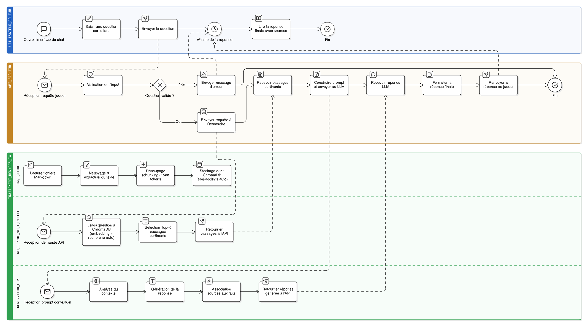

# Architecture technique — Projet Oracle

Ce document est destiné à l'équipe de développement. Il décrit comment le système est construit, les technologies utilisées, et comment les différentes parties communiquent entre elles.

## Vue d'ensemble

Le système repose sur une approche appelée RAG (Retrieval-Augmented Generation). L'idée est simple : plutôt que de demander à une IA de répondre de mémoire (et risquer qu'elle invente des choses), on va d'abord chercher les passages pertinents dans le lore, puis on les donne à l'IA comme contexte pour qu'elle formule sa réponse. Comme ça, l'IA se base uniquement sur les vrais documents du client.

Le fonctionnement se fait en deux temps :

**En amont (une seule fois, ou quand le lore est mis à jour) :**
```
Documents .md → Lecture et découpage en chunks → Stockage dans ChromaDB (qui génère les embeddings automatiquement)
```

**À chaque question d'un joueur :**
```
Question du joueur
       |
       v
Envoi de la question à ChromaDB (qui gère la conversion en embedding et la recherche automatiquement)
       |
       v
ChromaDB retourne les chunks les plus pertinents
       |
       v
Envoi de la question + chunks pertinents au LLM (DeepSeek / GPT 120B)
       |
       v
Le LLM génère une réponse basée sur le contexte
       |
       v
Réponse renvoyée au joueur
```

## Qu'est-ce qu'un embedding ?

Pour ceux qui ne sont pas familiers avec le concept : un embedding c'est une représentation numérique d'un texte. En gros, on transforme une phrase en une liste de nombres. Deux phrases qui parlent du même sujet auront des nombres proches. C'est grâce à ça qu'on peut chercher dans la base de données les passages qui sont sémantiquement proches de la question du joueur, même si les mots exacts ne sont pas les mêmes.

Par exemple, si un joueur demande "Qui dirige le royaume ?" et qu'un document parle du "souverain des terres de l'Ouest", le système comprendra que c'est lié, là où une simple recherche par mots-clés passerait à côté.

## Les modules en détail

### Module d'ingestion

C'est le point d'entrée des données. Ce module lit les fichiers de lore, les nettoie et les découpe en morceaux (des "chunks") d'environ 500 tokens. On garde un chevauchement de 100 tokens entre chaque morceau pour ne pas perdre de contexte quand une information est à cheval entre deux chunks.

Chaque chunk est ensuite stocké dans ChromaDB avec ses métadonnées (nom du fichier source, section, position). ChromaDB se charge automatiquement de générer les embeddings au moment du stockage. Cette étape ne se fait qu'une seule fois par document, ou quand le lore est mis à jour.

Pour le premier prototype, on travaille avec des fichiers Markdown (.md). C'est un choix délibéré : c'est simple à lire, à écrire, et à parser. Si le client utilise un autre format, on ajoutera un parser dédié à côté de celui qui existe déjà — le reste du système ne change pas.

Fichiers concernés :
- `src/ingestion/parser_md.py` — lecture et extraction du texte depuis les fichiers .md
- `src/ingestion/chunker.py` — découpage en chunks avec métadonnées
- `src/ingestion/loader.py` — stockage des chunks dans ChromaDB (qui gère les embeddings automatiquement)

### Module de recherche

Quand un joueur pose une question, ce module l'envoie à ChromaDB qui se charge de tout : convertir la question en embedding et trouver les chunks les plus similaires. On n'a pas besoin de gérer les embeddings manuellement, ChromaDB le fait nativement.

On récupère les 3 à 5 chunks les plus pertinents, avec leurs métadonnées (pour pouvoir citer les sources dans la réponse).

Fichiers concernés :
- `src/search/recherche.py` — recherche dans ChromaDB à partir d'une question

### Module de génération

Ce module prend la question du joueur et les chunks pertinents, construit un prompt contextualisé, et l'envoie au LLM pour obtenir une réponse.

Le prompt ressemble à quelque chose comme : "Voici des extraits du lore du jeu : [chunks]. En te basant uniquement sur ces extraits, réponds à la question suivante : [question du joueur]". L'instruction de se baser uniquement sur les extraits est importante pour éviter que l'IA invente des informations.

Pour le LLM, on utilise actuellement l'API DeepSeek avec une clé personnelle. L'objectif est de migrer vers le modèle GPT 120B mis à disposition par l'école. Le code est conçu pour que ce changement soit simple : il suffit de modifier l'URL de l'API et la clé, le reste ne bouge pas.

Fichiers concernés :
- `src/generation/generateur.py` — construction du prompt et appel au LLM

### API Backend

L'API fait le lien entre l'interface utilisateur et les modules. Elle expose un point d'accès qui accepte une question et retourne une réponse. On utilise Flask (une bibliothèque Python simple pour créer des serveurs web) ou FastAPI (une alternative similaire). Tout reste en Python.

Le flux est le suivant : l'API reçoit la question, appelle le module de recherche pour trouver les passages pertinents dans ChromaDB, passe le tout au module de génération qui appelle le LLM, et renvoie la réponse au joueur.

On prévoit aussi un point d'accès séparé pour déclencher l'ingestion de nouveaux documents (utile quand le client met à jour son lore).

Fichiers concernés :
- `src/api/app.py` — point d'entrée de l'API

### Interface utilisateur

Une page web simple avec un champ de texte et un affichage des réponses, style chat. Rien de compliqué, l'objectif est que ce soit fonctionnel et clair. On utilise du HTML/CSS/JavaScript basique.

Fichiers concernés :
- `src/frontend/index.html`

## Technologies utilisées

**ChromaDB** — Base de données vectorielle open-source. On l'a choisie parce qu'elle est simple à mettre en place, fonctionne en local sans serveur externe, et gère tout le processus d'embedding automatiquement. Quand on stocke un texte, ChromaDB le convertit en embedding. Quand on fait une recherche, ChromaDB convertit la question et trouve les résultats les plus proches. On n'a pas besoin de gérer ça nous-mêmes.

**DeepSeek API** (temporaire) — LLM utilisé pour la génération de réponses pendant le développement. On utilise une clé API personnelle pour le prototype.

**GPT 120B de l'école** (cible) — Le modèle qu'on prévoit d'utiliser en production. Le changement sera transparent grâce à l'abstraction dans le module de génération.

**Flask ou FastAPI** — Bibliothèques Python pour créer le serveur web. Tout le projet reste en Python, Flask/FastAPI c'est juste ce qui permet de recevoir les questions depuis le navigateur. Le choix final sera fait en équipe.

## Structure du projet

```
projet-oracle/
├── README.md                       # Présentation pour le client
├── .gitignore
├── docs/
│   ├── BPMN/                       # Schémas de processus
│   ├── architecture.md             # Ce document
│   └── reunion-client/             # Comptes-rendus des réunions
├── data/
│   └── sample/                     # Données de test (lore fictif)
├── src/
│   ├── ingestion/
│   │   ├── parser_md.py            # Parser Markdown
│   │   ├── chunker.py              # Découpage en chunks
│   │   └── loader.py               # Stockage dans ChromaDB
│   ├── search/
│   │   └── recherche.py            # Recherche dans ChromaDB
│   ├── generation/
│   │   └── generateur.py           # Construction du prompt + appel LLM
│   ├── api/
│   │   └── app.py                  # API Backend
│   └── frontend/
│       └── index.html              # Interface chat
├── tests/
│   ├── test_parser.py
│   ├── test_search.py
│   └── test_api.py
├── requirements.txt
└── chroma_db/                      # Base vectorielle ChromaDB (local, pas sur Git)
```

## Choix techniques et justifications

**Pourquoi du RAG plutôt qu'un LLM seul ?** Un LLM seul invente des réponses quand il ne sait pas. Avec le RAG, on lui donne le contexte exact du lore, donc il ne peut répondre que sur base de ce qu'on lui fournit. C'est crucial pour un assistant de lore qui doit être fidèle aux documents originaux.

**Pourquoi ChromaDB ?** C'est la solution la plus simple pour un prototype. Pas besoin de serveur externe, ça tourne en local, et ça fait exactement ce dont on a besoin : stocker des embeddings et faire de la recherche par similarité.

**Pourquoi Markdown pour commencer ?** Le prof nous a conseillé de choisir un format et de faire tout le pipeline avec. Markdown est simple et facile à parser. Si le client utilise autre chose, on ajoute un parser sans toucher au reste grâce à l'architecture modulaire.

**Pourquoi DeepSeek en attendant ?** On a une clé API disponible tout de suite. L'abstraction dans le code permet de changer de modèle sans refactoring. Quand le GPT 120B de l'école sera accessible, le changement prendra quelques minutes.

## Répartition du travail

L'équipe est composée de quatre personnes.

Emir s'occupe de la coordination du projet, du module d'ingestion (parser, chunker, loader), de la mise en place du repo GitLab, et des tests.

Ediz prend en charge le module de recherche et les tests de pertinence des résultats ChromaDB.

Nicolas développe l'API backend, gère les points d'accès et la liaison entre les modules.

Tom s'occupe de l'interface chat et de la documentation (données de test, comptes-rendus de réunion).

## Conventions de travail

Pour les commits, on utilise des préfixes pour garder un historique lisible :

- `feat:` pour une nouvelle fonctionnalité
- `fix:` pour une correction
- `docs:` pour la documentation
- `test:` pour les tests
- `chore:` pour la maintenance

Pour les branches, chacun travaille sur sa propre branche (`feature/nom-de-la-feature`) et crée une Merge Request vers `develop` quand c'est prêt. La branche `main` ne reçoit que du code stable et validé.

## Prochaines étapes

La priorité immédiate est d'avoir le pipeline RAG complet qui fonctionne avec du Markdown : ingestion dans ChromaDB → recherche vectorielle → génération de réponse via DeepSeek. Une fois que tout le pipeline marche de bout en bout, on ajoute l'interface chat et on prépare la démo pour le client.

Voici le diagramme BPMN complet du système :

